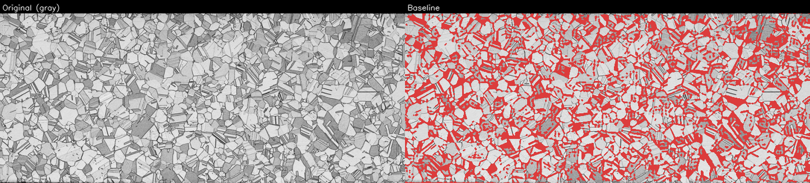
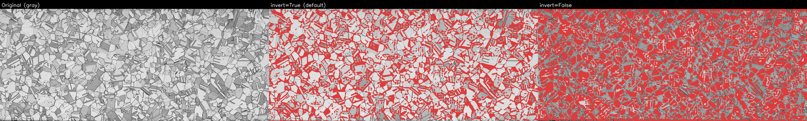
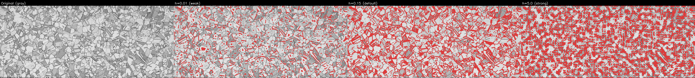
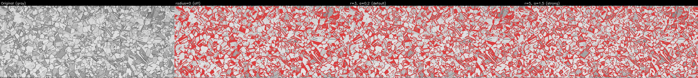
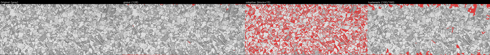
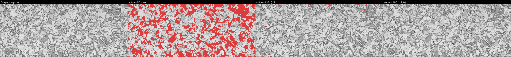
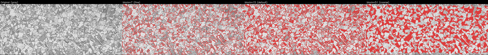
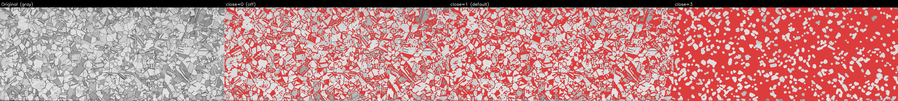
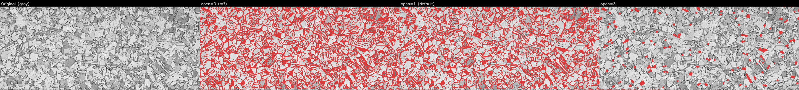
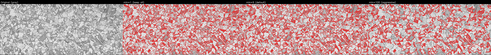

# Parameter Guide — Grain Size Detection

This guide explains each parameter in the **Analysis Settings** dialog and how it affects grain boundary detection.  
All example images are cropped to the grain ROI of `tests/sample/c2600p_asis.png`.  
Red pixels in the result images indicate detected grain boundaries.

---

## Baseline result

The image below shows the result with the optimized baseline parameters for `c2600p_asis.png`.



---

## 0. Detection Mode (`detection_method`)

| Value | Description |
|---|---|
| `"threshold"` | **(default)** GSAT pipeline — grayscale → threshold → binary boundary image. Use for images with clear dark or bright boundary lines between grains (etched optical micrographs, polished SEM). |
| `"color_region"` | Felzenszwalb graph-based segmentation — identifies contiguous regions of similar color as individual grains. Use when grains differ in color rather than having visible boundary lines (EBSD maps, strongly etched color micrographs). |

When `"threshold"` is selected, configure parameters in **Section 1**.  
When `"color_region"` is selected, configure parameters in **Section 0a** below; the GSAT pipeline is bypassed entirely.

---

### 0a. Color-Region Segmentation (Felzenszwalb)

These parameters apply only when `detection_method = "color_region"`.

#### `color_scale`

| Default | 200.0 |
|---|---|
| Range | 10 – 5000 |

Controls the threshold on graph edge weights — the key sensitivity parameter. A higher value merges more adjacent regions together, producing fewer and larger grains. A lower value keeps more regions separate, producing more and smaller grains.

- `color_scale = 50–100`: fine segmentation; many small grains. Use for fine-grained microstructures.
- `color_scale = 200–500`: moderate segmentation; typical starting point.
- `color_scale = 1000+`: coarse segmentation; only large color blocks remain.

**Start at 200 and adjust** by looking at the overlay image: if many small fragments appear inside what should be a single grain, increase the scale. If neighboring grains merge into one, decrease it.

#### `color_sigma`

| Default | 0.8 |
|---|---|
| Range | 0.0 – 5.0 |

Standard deviation of the Gaussian smoothing applied to the image before segmentation. Higher values blur the image more, reducing the effect of fine texture and noise within grains.

- `color_sigma = 0.0`: no smoothing — every pixel color variation is considered.
- `color_sigma = 0.5–1.0`: mild smoothing; recommended for most optical images.
- `color_sigma = 2.0+`: heavy smoothing; use only when grain interiors have strong texture that causes false sub-grain splits.

#### `color_min_size`

| Default | 100 px² |
|---|---|
| Range | 10 – 50 000 |

Minimum area of a segment in pixels. Any region smaller than this is merged into its largest neighboring region. Use this to eliminate small boundary artifacts and surface noise.

- `color_min_size = 50–100`: removes only tiny speckles.
- `color_min_size = 500–2000`: aggressively eliminates small regions; use when fine texture creates many sub-grain fragments.

#### `color_morph_close_radius`

| Default | 0 (disabled) |
|---|---|
| Range | 0 – 20 |

After boundaries are computed from the Felzenszwalb result, a morphological closing (dilation then erosion) of this radius is applied to seal small gaps in boundary lines. When non-zero, the boundary image is re-used to run watershed and re-derive the grain label map.

- `radius = 0`: disabled; use the raw Felzenszwalb boundaries.
- `radius = 1–2`: closes 1–3 px gaps; useful when thin color gradients produce slightly broken boundaries.
- `radius ≥ 4`: may connect unrelated boundaries.

---

## 1. Segmentation (GSAT pipeline)

The segmentation section converts a grayscale image into a binary boundary image through a fixed sequence of steps:

```
Invert → [CLAHE] → Denoise → Sharpen → Threshold → Morphological ops → Remove small features
```

---

### 1.1 Grayscale Inversion (`invert_grayscale`)

| Setting | Value |
|---|---|
| Default | **On** |
| When to use | Enable for images where grain boundaries are **dark** on a bright background (optical microscopy). Disable for SEM images where boundaries are **bright**. |



**Effect:** Inverting before thresholding ensures that the boundary pixels become white (255) in the binary image. Getting this wrong will produce a completely filled or completely empty result.

---

### 1.1b CLAHE Preprocessing (`clahe_clip_limit`, `clahe_tile_size`)

| Setting | Value |
|---|---|
| Default clip limit | **0.0** (disabled) |
| Range | 0.0 – 20.0 |
| Default tile size | **8** |
| Algorithm | Contrast Limited Adaptive Histogram Equalization |

**What it does:** CLAHE redistributes local contrast across the image in small independent tiles. Unlike global histogram equalization, it enhances faint boundaries in low-contrast regions without washing out well-contrasted boundaries elsewhere.

**When to use:** Enable when some grain interiors have similar brightness to their boundaries — "gray-area grains" that look like grains to the human eye but are not detected. This is common in optical micrographs of brass/copper alloys where different grain orientations produce subtle etching contrast.

- `clahe_clip_limit = 0.0`: Disabled — no CLAHE applied (default).
- `clahe_clip_limit = 1.0–3.0`: Mild enhancement; recommended starting point for gray-area problems.
- `clahe_clip_limit = 5.0+`: Aggressive enhancement; may amplify noise, especially in SEM images.
- `clahe_tile_size`: Size of each equalization tile in pixels. Smaller values (4–8) give finer local normalization; larger values (16–32) are smoother. Choose a tile size roughly equal to the typical grain diameter.

**Applied after:** Grayscale inversion. **Applied before:** Denoising.

**Tip:** Run `optimize_params.py` with `clahe_clip_limit` in the search space to find the best value automatically for your sample.

---

### 1.2 Denoising Strength (`denoise_h`)

| Setting | Value |
|---|---|
| Default | **0.15** |
| Range | 0.01 – 100.0 |
| Algorithm | Non-local Means (NL-Means) |



**Effect:** `h` controls how aggressively similar patches are averaged.

- **Too low (e.g. 0.01):** Noise survives and creates spurious thin boundaries after thresholding.
- **Too high (e.g. 5.0):** Real boundaries are blurred away and become difficult to threshold.

Start around **0.05 – 0.3** and increase if you see many small speckle boundaries; decrease if real boundaries disappear.

---

### 1.3 Sharpening (`sharpen_radius`, `sharpen_amount`)

| Setting | Value |
|---|---|
| Default radius | **3** |
| Default amount | **0.2** |
| Range radius | 0 – 20 |
| Range amount | 0.0 – 10.0 |
| Algorithm | Unsharp mask |



**Effect:** Unsharp masking enhances edge contrast by subtracting a blurred copy of the image.

- `sharpen_radius`: Size of the Gaussian blur used as the base. Larger values sharpen broader, softer edges.
- `sharpen_amount`: Strength of the enhancement. Values above 1.0 can over-sharpen and introduce halos.

**Tip:** Set `sharpen_radius = 0` to disable sharpening entirely if boundaries are already crisp.

---

### 1.4 Threshold Method (`threshold_method`)

Three methods are available:

| Method | Best for |
|---|---|
| **Global threshold** | Uniform illumination; simple bright/dark separation |
| **Adaptive threshold** | Uneven illumination across the image |
| **Hysteresis threshold** | Connecting weak but real boundary segments |



---

#### 1.4a Global Threshold (`threshold_value`)

| Setting | Value |
|---|---|
| Default | **128** |
| Range | 0 – 255 |



**Effect:** Pixels above `threshold_value` become boundary (white); others become interior (black).

- **Low value:** More pixels become boundaries → over-segmentation, thick or merged boundaries.
- **High value:** Fewer pixels become boundaries → missing boundaries, large gaps.

Use the histogram of your preprocessed image to pick a value at the valley between grain interior and boundary intensities.

---

#### 1.4b Adaptive Threshold Block Size (`adaptive_block_size`)

| Setting | Value |
|---|---|
| Default | **15** |
| Range | 3 – 201 (odd numbers only) |



**Effect:** Each pixel is compared to the average of its `block_size × block_size` neighbourhood.

- **Small block (e.g. 7):** Reacts to very local contrast changes — good for fine structures but sensitive to noise.
- **Large block (e.g. 51):** Adapts to broad illumination gradients — may merge fine boundaries.

Choose a block size roughly **2–4× the typical grain boundary width** in pixels.

---

#### 1.4c Hysteresis Thresholds (`threshold_value` / `threshold_high`)

Two thresholds work together:

- Pixels above `threshold_high` are definite boundaries.
- Pixels between `threshold_value` (low) and `threshold_high` are accepted only if they are **connected to a definite boundary**.
- Pixels below `threshold_value` are discarded.

**Guidance:** Set `threshold_high` just above the clear boundary peaks, and `threshold_value` 20–60 counts lower to allow weak but connected segments to survive.

---

### 1.5 Morphological Closing (`morph_close_radius`)

| Setting | Value |
|---|---|
| Default | **0** (off) |
| Range | 0 – 20 |
| Effect | Fills small gaps in boundary lines |



**Effect:** Closing = dilation then erosion. It bridges small breaks in boundary lines without significantly thickening them.

- `radius = 0`: disabled.
- `radius = 1`: closes gaps of 1–2 pixels — good for slightly broken boundaries.
- `radius ≥ 3`: can connect unrelated boundaries that happen to be close together.

---

### 1.6 Morphological Opening (`morph_open_radius`)

| Setting | Value |
|---|---|
| Default | **1** |
| Range | 0 – 20 |
| Effect | Removes isolated small noise pixels |



**Effect:** Opening = erosion then dilation. It removes thin spurs and isolated noise spots that are smaller than the structuring element.

- `radius = 0`: disabled.
- `radius = 1`: removes single-pixel or very thin noise — recommended for most images.
- `radius ≥ 3`: may thin or break real thin boundaries.

---

### 1.7 Minimum Feature Size (`min_feature_size`)

| Setting | Value |
|---|---|
| Default | **9** px² |
| Range | 1 – 10 000 |
| Effect | Removes connected boundary components smaller than this area |



**Effect:** After thresholding and morphological operations, small isolated clusters of boundary pixels (dust, surface scratches) remain. This filter removes any connected component whose pixel count is below `min_feature_size`.

- **Low value (1):** No removal — all noise survives.
- **Medium value (9–64):** Removes single-pixel and small speckle noise.
- **High value (100+):** Aggressively removes small features; may delete real small boundaries in fine-grained materials.

---

## 2. Grain Area Measurement (Track B)

These parameters control which detected grains are counted and exported.

### 2.1 Minimum Grain Area (`min_grain_area`)

| Default | 50 px² |
|---|---|

Grains with fewer pixels than this value are discarded from the results. Increase this to filter out noise-segmented micrograins; decrease it if your material has genuine very small grains.

### 2.2 Exclude Edge Grains (`exclude_edge_grains`)

| Default | On |
|---|---|

When enabled, any grain whose bounding box touches within `edge_buffer` pixels of the image (or grain ROI) border is excluded. Edge grains are partially outside the field of view, so their area is underestimated.

**When to disable:** If your image is carefully cropped to include only complete grains, or if you need maximum grain count and accept the bias.

### 2.3 Edge Buffer (`edge_buffer`)

| Default | 5 px |
|---|---|

The pixel margin from the image/ROI border used to decide if a grain is an "edge grain". Increase if large grains near the border are being included erroneously.

---

## 3. Intercept / Chord Measurement (Track A)

These parameters control the line grid used for the ASTM E112 intercept method.

### 3.1 Line Spacing (`line_spacing`)

| Default | 20 px |
|---|---|

Distance in pixels between parallel scan lines. Smaller spacing → more chords measured → better statistics but longer processing. A spacing of **15–30 px** is typical; for very fine grains, reduce to **5–10 px**.

### 3.2 Scan Angles (`theta_start`, `theta_end`, `n_theta_steps`)

| Default | 0° to 135°, 4 steps |
|---|---|

The image is rotated to `n_theta_steps` equally-spaced angles between `theta_start` and `theta_end`, and the scan lines are applied at each angle. Using multiple angles averages out directional bias (important for non-equiaxed grains).

- **`n_theta_steps = 1`:** Horizontal lines only — fast but biased for elongated grains.
- **`n_theta_steps = 4`:** 0°, 45°, 90°, 135° — standard ASTM multi-angle approach.

---

## 4. Scale (`pixels_per_um`)

| Unit | px / µm |
|---|---|
| Auto-detect | Click "自動検出" |

Set this to convert pixel measurements to physical units (µm, µm², ASTM grain size number G).  
Use the **自動検出** button to let the software detect the scale bar automatically and fill in the value.  
If the auto-detection result looks wrong (verify from the highlighted scale bar overlay in the image viewer), override it manually.

---

## 5. Region of Interest (ROI)

### Grain ROI
Restricts grain counting and centroid filtering to a rectangular sub-area. Use this to exclude the scale bar area or image annotations from the grain analysis.

### Marker ROI
Restricts scale bar auto-detection to a sub-area. Use this when the scale bar is in a specific corner of the image to avoid false positives from text or other features.

Both ROIs can be drawn interactively by clicking **Select ROI** in the settings dialog, or entered numerically as (x, y, width, height) in pixels.

---

## 6. Parameter Optimizer

The parameter optimizer automatically searches for the combination of segmentation parameters that produces the most valid grain detections for your image.

### Running from the GUI

1. Load an image and set the **Grain ROI** (required).
2. Optionally set the Marker ROI and run scale bar detection.
3. From the menu: **ファイル → パラメータ最適化を実行...**
4. The optimizer runs in the background (this may take a minute or two).
5. When complete, the best-found parameters are loaded automatically and image processing + grain calculation start immediately.

The optimizer saves two files next to the image:
- `{stem}_params.json` — the starting parameters (current UI state)
- `{stem}_params_optimized.json` — the best parameters found

### Running from the terminal

```bash
uv run scripts/optimize_params.py --params path/to/params.json --out path/to/params_optimized.json
```

The input `params.json` must contain `image_path` and `grain_roi`. Save it from the GUI via **ファイル → パラメータを保存...** first.

### What the optimizer searches

The search strategy depends on the **detection mode** selected in the UI when the optimizer is launched.

#### Grayscale threshold mode (GSAT)

Two-phase search:

- **Phase 1:** Exhaustive sweep of `invert_grayscale × threshold_method` (6 combinations) to find the top 2.
- **Phase 2:** 150-sample random search over the remaining parameters (denoise, sharpen, threshold values, morphology radii, CLAHE, feature sizes) within each top combo.

#### Color-region mode (Felzenszwalb)

Single-phase search (Phase 1 is skipped):

- **Phase 2:** 150-sample random search over `color_scale`, `color_sigma`, `color_min_size`, and `color_morph_close_radius`.

#### Score function (both modes)

**Score:** `grain_count × coverage_ratio` (capped at 0.90). This rewards finding more genuine grains covering more of the ROI area.

### Loading an existing optimized JSON

Open **ファイル → パラメータを開く...** and select a `*_params_optimized.json` (or any params JSON). The parameters are restored and image processing starts automatically.
