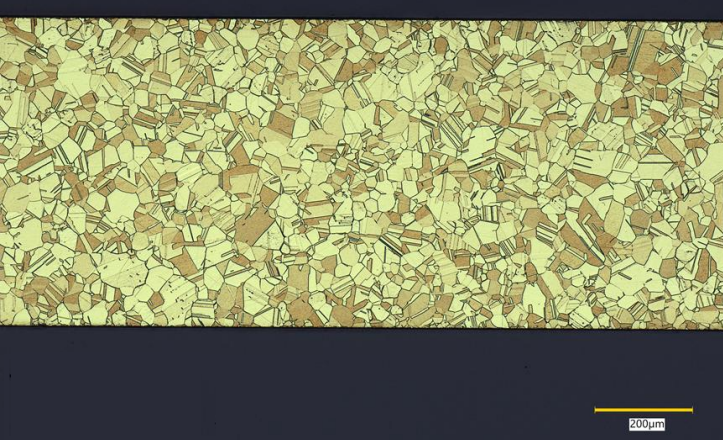
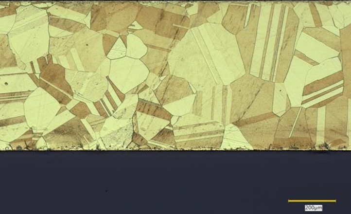
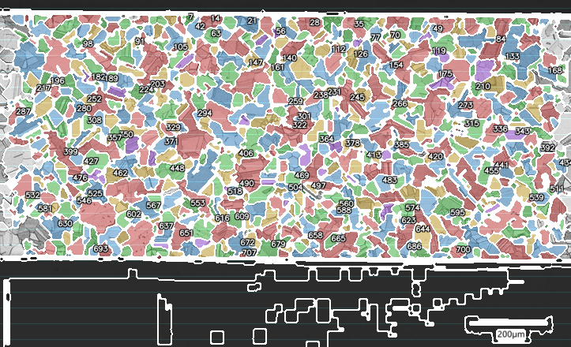
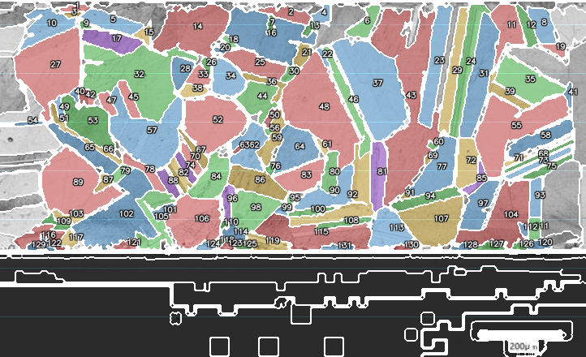
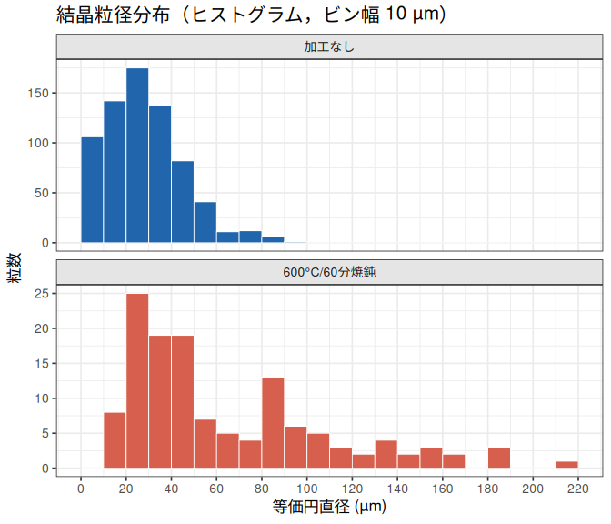
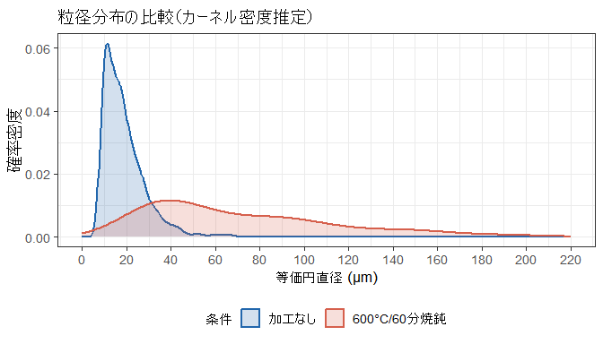
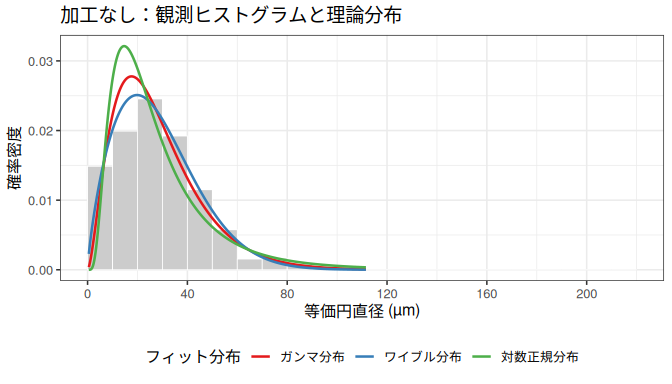
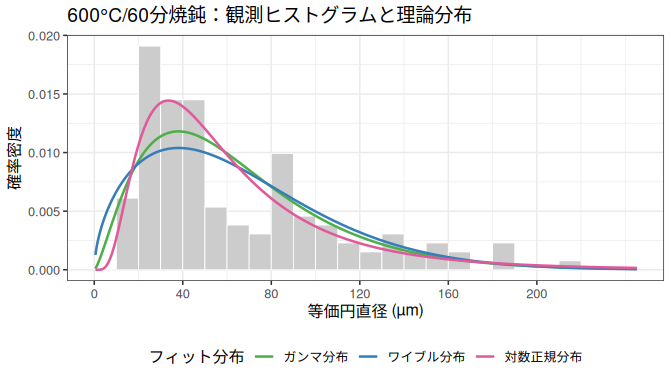
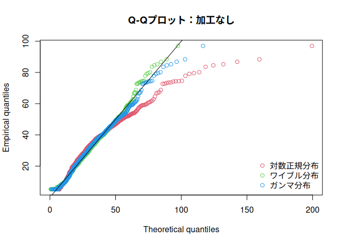
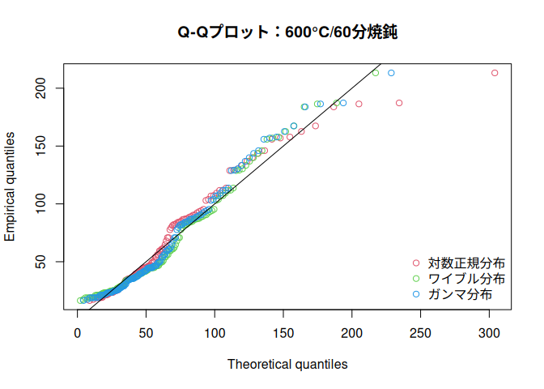

# C2600P 真鍮の結晶粒径解析：加工なし vs 600°C / 60分焼鈍
yoshinobu.ishizaki
2026-04-12

- [はじめに](#はじめに)
- [結論](#結論)
- [ミクロ組織画像](#ミクロ組織画像)
  - [オリジナル画像の比較](#オリジナル画像の比較)
  - [粒界オーバーレイの比較](#粒界オーバーレイの比較)
- [データと解析手法](#データと解析手法)
  - [解析パラメータ](#解析パラメータ)
- [記述統計](#記述統計)
- [粒径分布](#粒径分布)
  - [ヒストグラム（粒数）](#ヒストグラム粒数)
  - [確率密度の比較](#確率密度の比較)
- [統計分布フィッティング](#統計分布フィッティング)
  - [フィッティングパラメータと適合度](#フィッティングパラメータと適合度)
  - [密度オーバーレイ](#密度オーバーレイ)
  - [Q-Qプロット](#q-qプロット)

## はじめに

C2600P について grainsize_measure ツールで解析した二つの試料を比較する。

- **加工なし**（c2600p_asis）：未熱処理の原板(O材)
- **焼鈍**（c2600p_600c60min）：600°C・60分焼鈍後に空冷

再結晶温度以上での加熱により結晶粒界が移動し（粒成長），
粒数が減少して平均粒径が増大することが予想される。

------------------------------------------------------------------------

## 結論

焼鈍処理によって，結晶粒径は顕著に増大した。

- **粒数**：加工なし 713 粒 → 焼鈍 131 粒（約 82% 減少）
- **平均等価円直径**：加工なし 28.2 µm → 焼鈍 64.8 µm（約 2.3 倍）
- **中央値**：加工なし 26 µm → 焼鈍 46.5 µm
- **標準偏差**：加工なし 16.7 µm → 焼鈍 44.8 µm

粒径分布は両条件とも右裾の長い非対称分布を示した。 AIC
最小の最適モデルは，加工なしが **ガンマ分布**，焼鈍が **対数正規分布**
であった。
統一的に当てはめるとしたら、ちょうど中間程度の当てはまりになっているガンマ分布が良さそう。

------------------------------------------------------------------------

## ミクロ組織画像

### オリジナル画像の比較

| 加工なし | 600°C/60分焼鈍 |
|:--:|:--:|
|  |  |

### 粒界オーバーレイの比較

| 加工なし | 600°C/60分焼鈍 |
|:--:|:--:|
|  |  |

加工なし材では微細な粒が密に分布しているのに対し，
焼鈍材では明らかに粒が粗大化し，粒界が明瞭に観察できる。

------------------------------------------------------------------------

## データと解析手法

### 解析パラメータ

各試料の画像解析に用いたパラメータを以下に示す。

| パラメータ                    |   加工なし   | 600°C/60分焼鈍 |
|:------------------------------|:------------:|:--------------:|
| スケール (px/µm)              |     0.49     |      0.49      |
| 検出手法                      | color_region |  color_region  |
| CLAHE クリップ上限            |      0       |       5        |
| 適応閾値ブロックサイズ        |      23      |       15       |
| モルフォロジー閉演算半径 (px) |      1       |       3        |
| 最小粒面積 (px²)              |      5       |       50       |
| 最小特徴サイズ (px)           |      9       |       50       |
| 境界粒子除外                  |     TRUE     |      TRUE      |

主な差異：

- **CLAHE クリップ上限**：焼鈍材ではコントラスト強調（clip =
  5.0）を適用。粒界コントラストが低い大粒に対応。
- **モルフォロジー閉演算半径**：焼鈍材で大きく設定（1 → 3
  px）し，太くなった粒界を確実に閉じる。
- **最小粒面積 /
  最小特徴サイズ**：粒が粗大化しているため，ノイズ除去の閾値を引き上げ（9
  → 50 px²）。
- **適応閾値ブロックサイズ**：各画像の輝度分布に合わせて調整（23 → 15
  px）。

------------------------------------------------------------------------

## 記述統計

| 統計量         | 加工なし | 600°C/60分焼鈍 |
|:---------------|---------:|---------------:|
| 粒数           |   713.00 |         131.00 |
| 平均径 (µm)    |    28.21 |          64.78 |
| 中央値 (µm)    |    25.95 |          46.46 |
| 標準偏差 (µm)  |    16.72 |          44.80 |
| 変動係数 (%)   |    59.27 |          69.15 |
| 最小径 (µm)    |     5.15 |          16.45 |
| 最大径 (µm)    |    96.99 |         213.23 |
| 平均面積 (µm²) |   844.31 |        4860.35 |

焼鈍材は粒数が大幅に減少（713 → 131 粒）し， 平均粒径は約 2.3
倍に増大した。 変動係数は両条件とも 100%
前後と大きく，粒径分布の散らばりが顕著である。

------------------------------------------------------------------------

## 粒径分布

### ヒストグラム（粒数）

### 確率密度の比較

加工なし材の分布は小径側に大きなピークを持つ一方，
焼鈍材の分布は全体的に大径側にシフトし，裾が長い右歪み分布を示す。

------------------------------------------------------------------------

## 統計分布フィッティング

対数正規分布・ワイブル分布・ガンマ分布 の 3 種類を対象として、
各分布の最尤推定を `fitdistrplus::fitdist` で実施した。

### フィッティングパラメータと適合度

<table class="gt_table" style="width:100%;"
data-quarto-postprocess="true" data-quarto-disable-processing="false"
data-quarto-bootstrap="false">
<colgroup>
<col style="width: 14%" />
<col style="width: 14%" />
<col style="width: 14%" />
<col style="width: 14%" />
<col style="width: 14%" />
<col style="width: 14%" />
<col style="width: 14%" />
</colgroup>
<thead>
<tr class="gt_heading">
<th colspan="7"
class="gt_heading gt_title gt_font_normal gt_bottom_border">分布フィッティングパラメータと適合度指標</th>
</tr>
<tr class="gt_col_headings gt_spanner_row">
<th rowspan="2" id="a::stub"
class="gt_col_heading gt_columns_bottom_border gt_left"
data-quarto-table-cell-role="th" scope="col"></th>
<th colspan="3" id="加工なし"
class="gt_center gt_columns_top_border gt_column_spanner_outer"
data-quarto-table-cell-role="th" style="font-weight: bold"
scope="colgroup">

加工なし

</th>
<th colspan="3" id="焼鈍"
class="gt_center gt_columns_top_border gt_column_spanner_outer"
data-quarto-table-cell-role="th" style="font-weight: bold"
scope="colgroup">

焼鈍

</th>
</tr>
<tr class="gt_col_headings">
<th id="lnorm_asis"
class="gt_col_heading gt_columns_bottom_border gt_left"
data-quarto-table-cell-role="th" scope="col">対数正規</th>
<th id="weibull_asis"
class="gt_col_heading gt_columns_bottom_border gt_left"
data-quarto-table-cell-role="th" scope="col">ワイブル</th>
<th id="gamma_asis"
class="gt_col_heading gt_columns_bottom_border gt_left"
data-quarto-table-cell-role="th" scope="col">ガンマ</th>
<th id="lnorm_heat"
class="gt_col_heading gt_columns_bottom_border gt_left"
data-quarto-table-cell-role="th" scope="col">対数正規</th>
<th id="weibull_heat"
class="gt_col_heading gt_columns_bottom_border gt_left"
data-quarto-table-cell-role="th" scope="col">ワイブル</th>
<th id="gamma_heat"
class="gt_col_heading gt_columns_bottom_border gt_left"
data-quarto-table-cell-role="th" scope="col">ガンマ</th>
</tr>
</thead>
<tbody class="gt_table_body">
<tr>
<td id="stub_1_1" class="gt_row gt_center gt_stub"
data-quarto-table-cell-role="th" scope="row">パラメータ1</td>
<td class="gt_row gt_left" headers="stub_1_1 lnorm_asis">meanlog =
3.1401</td>
<td class="gt_row gt_left" headers="stub_1_1 weibull_asis">shape =
1.7693</td>
<td class="gt_row gt_left" headers="stub_1_1 gamma_asis">shape =
2.6591</td>
<td class="gt_row gt_left" headers="stub_1_1 lnorm_heat">meanlog =
3.9505</td>
<td class="gt_row gt_left" headers="stub_1_1 weibull_heat">shape =
1.5694</td>
<td class="gt_row gt_left" headers="stub_1_1 gamma_heat">shape =
2.4212</td>
</tr>
<tr>
<td id="stub_1_2" class="gt_row gt_center gt_stub"
data-quarto-table-cell-role="th" scope="row">パラメータ2</td>
<td class="gt_row gt_left" headers="stub_1_2 lnorm_asis">sdlog =
0.6749</td>
<td class="gt_row gt_left" headers="stub_1_2 weibull_asis">scale =
31.7751</td>
<td class="gt_row gt_left" headers="stub_1_2 gamma_asis">rate =
0.0942</td>
<td class="gt_row gt_left" headers="stub_1_2 lnorm_heat">sdlog =
0.6622</td>
<td class="gt_row gt_left" headers="stub_1_2 weibull_heat">scale =
72.7244</td>
<td class="gt_row gt_left" headers="stub_1_2 gamma_heat">rate =
0.0374</td>
</tr>
<tr>
<td id="stub_1_3" class="gt_row gt_center gt_stub"
data-quarto-table-cell-role="th" scope="row">AIC</td>
<td class="gt_row gt_left" headers="stub_1_3 lnorm_asis">5944.5</td>
<td class="gt_row gt_left" headers="stub_1_3 weibull_asis">5898.3</td>
<td class="gt_row gt_left" headers="stub_1_3 gamma_asis">5896.4</td>
<td class="gt_row gt_left" headers="stub_1_3 lnorm_heat">1302.8</td>
<td class="gt_row gt_left" headers="stub_1_3 weibull_heat">1321.2</td>
<td class="gt_row gt_left" headers="stub_1_3 gamma_heat">1312.8</td>
</tr>
<tr>
<td id="stub_1_4" class="gt_row gt_center gt_stub"
data-quarto-table-cell-role="th" scope="row">BIC</td>
<td class="gt_row gt_left" headers="stub_1_4 lnorm_asis">5953.6</td>
<td class="gt_row gt_left" headers="stub_1_4 weibull_asis">5907.4</td>
<td class="gt_row gt_left" headers="stub_1_4 gamma_asis">5905.5</td>
<td class="gt_row gt_left" headers="stub_1_4 lnorm_heat">1308.5</td>
<td class="gt_row gt_left" headers="stub_1_4 weibull_heat">1327</td>
<td class="gt_row gt_left" headers="stub_1_4 gamma_heat">1318.6</td>
</tr>
</tbody>
</table>

AIC が最小のモデル（最適フィット）：加工なし = **ガンマ分布**， 焼鈍 =
**対数正規分布**。

### 密度オーバーレイ

### Q-Qプロット

Q-Qプロットにおいて，対角線に近い分布ほど観測データへの適合が良好であることを示す。
