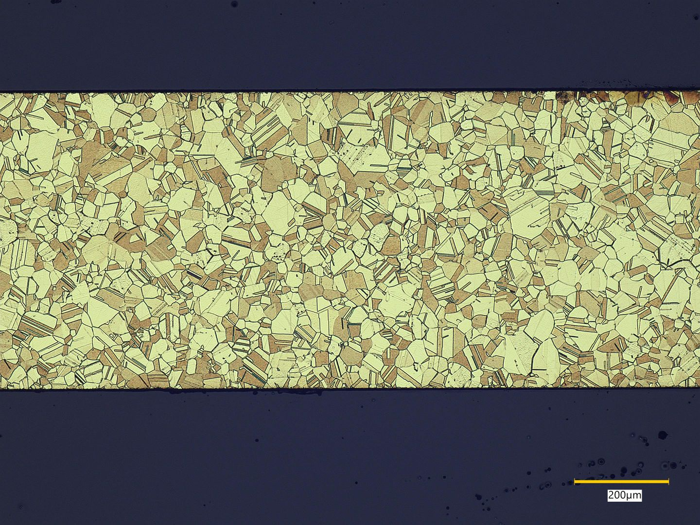
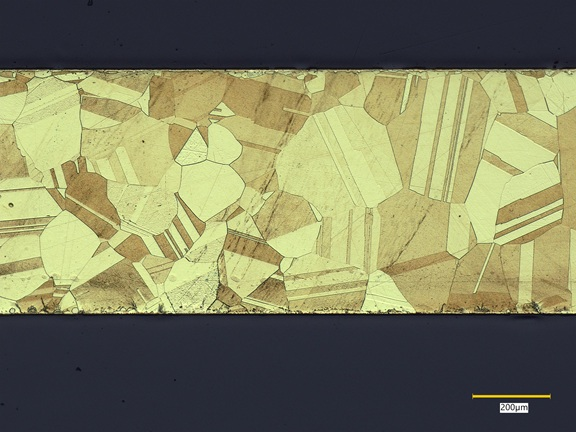
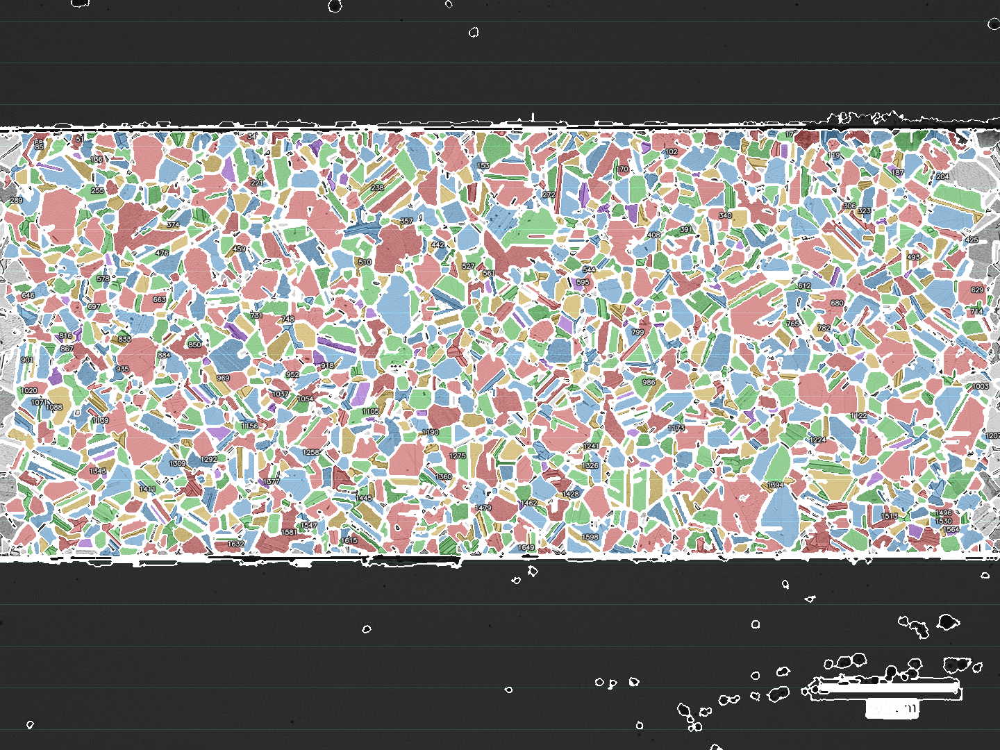
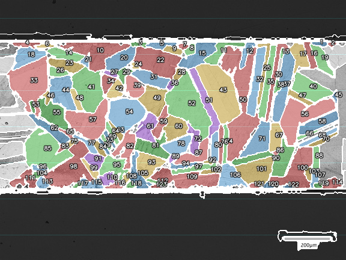

```{r setup, include=FALSE}
library(tidyverse)
library(jsonlite)
library(fitdistrplus)
library(knitr)
library(gt)

# ---- パラメータ読み込み ----
params_asis <- fromJSON("20260408_C2600-06tx200_s_params.json")
params_heat <- fromJSON("20260408_C2600-06tHT600C1hrx200_params.json")

# ---- 粒径データ読み込み ----
cond_levels <- c("加工なし", "600°C/60分焼鈍")

asis <- read_csv("20260408_C2600-06tx200_s_grain.csv", show_col_types = FALSE) |>
  mutate(condition = factor("加工なし", levels = cond_levels))

heat <- read_csv("20260408_C2600-06tHT600C1hrx200_grain.csv", show_col_types = FALSE) |>
  mutate(condition = factor("600°C/60分焼鈍", levels = cond_levels))

grains <- bind_rows(asis, heat)

# ---- 記述統計 ----
stats_tbl <- grains |>
  group_by(condition) |>
  summarise(
    粒数         = n(),
    平均径_µm    = mean(equivalent_diameter_um),
    中央値径_µm  = median(equivalent_diameter_um),
    標準偏差_µm  = sd(equivalent_diameter_um),
    変動係数_pct = 100 * sd(equivalent_diameter_um) / mean(equivalent_diameter_um),
    最小径_µm    = min(equivalent_diameter_um),
    最大径_µm    = max(equivalent_diameter_um),
    平均面積_µm2 = mean(area_um2),
    .groups = "drop"
  )

n_asis  <- stats_tbl |> filter(condition == "加工なし")         |> pull(粒数)
n_heat  <- stats_tbl |> filter(condition == "600°C/60分焼鈍") |> pull(粒数)
mu_asis <- stats_tbl |> filter(condition == "加工なし")         |> pull(平均径_µm)
mu_heat <- stats_tbl |> filter(condition == "600°C/60分焼鈍") |> pull(平均径_µm)
med_asis <- stats_tbl |> filter(condition == "加工なし")        |> pull(中央値径_µm)
med_heat <- stats_tbl |> filter(condition == "600°C/60分焼鈍")|> pull(中央値径_µm)
sd_asis <- stats_tbl |> filter(condition == "加工なし")         |> pull(標準偏差_µm)
sd_heat <- stats_tbl |> filter(condition == "600°C/60分焼鈍") |> pull(標準偏差_µm)

# ---- 分布フィッティング ----
fit_dists <- function(x) {
  list(
    lnorm   = fitdist(x, "lnorm"),
    weibull = fitdist(x, "weibull"),
    gamma   = fitdist(x, "gamma")
  )
}

# 分布ごとの統一カラー（密度オーバーレイ・Q-Qプロット共通）
dist_colours <- c(
  "対数正規分布" = "#E05A9A",
  "ワイブル分布" = "#377EB8",
  "ガンマ分布"   = "#4DAF4A"
)

fits_asis <- fit_dists(asis$equivalent_diameter_um)
fits_heat <- fit_dists(heat$equivalent_diameter_um)

# フィット結果テーブル作成
dist_names_jp <- c(lnorm = "対数正規分布", weibull = "ワイブル分布", gamma = "ガンマ分布")

extract_fit_info <- function(fits, cond_label) {
  map_dfr(names(fits), function(dist) {
    f <- fits[[dist]]
    p <- f$estimate
    tibble(
      条件         = cond_label,
      分布         = dist_names_jp[dist],
      パラメータ1  = sprintf("%s = %.4f", names(p)[1], p[1]),
      パラメータ2  = sprintf("%s = %.4f", names(p)[2], p[2]),
      AIC          = round(f$aic, 1),
      BIC          = round(f$bic, 1)
    )
  })
}

fit_info <- bind_rows(
  extract_fit_info(fits_asis, "加工なし"),
  extract_fit_info(fits_heat, "600°C/60分焼鈍")
)

# 各条件でAICが最小の分布名を取得
best_asis <- fit_info |> filter(条件 == "加工なし")         |> slice_min(AIC, n = 1) |> pull(分布)
best_heat <- fit_info |> filter(条件 == "600°C/60分焼鈍") |> slice_min(AIC, n = 1) |> pull(分布)

# ---- フィットオーバーレイ描画関数 ----
plot_fit_overlay <- function(df, fits, title_label) {
  x_max <- max(df$equivalent_diameter_um) * 1.15
  x_seq <- seq(0.5, x_max, length.out = 500)

  curve_data <- map_dfr(names(fits), function(dist) {
    f <- fits[[dist]]
    p <- f$estimate
    y <- switch(dist,
      lnorm   = dlnorm(x_seq,   p["meanlog"], p["sdlog"]),
      weibull = dweibull(x_seq, p["shape"],   p["scale"]),
      gamma   = dgamma(x_seq,   p["shape"],   p["rate"])
    )
    tibble(x = x_seq, y = y, 分布 = dist_names_jp[dist])
  })

  ggplot() +
    geom_histogram(
      data = df,
      aes(x = equivalent_diameter_um, y = after_stat(density)),
      binwidth = 10, boundary = 0,
      fill = "grey80", colour = "white", linewidth = 0.3
    ) +
    geom_line(
      data = curve_data,
      aes(x = x, y = y, colour = 分布),
      linewidth = 0.9
    ) +
    scale_x_continuous(limits = c(0, max(x_max, 220)), breaks = seq(0, 220, 40)) +
    scale_colour_manual(values = dist_colours) +
    labs(
      x = "等価円直径 (µm)", y = "確率密度",
      title = title_label,
      colour = "フィット分布"
    ) +
    theme_bw(base_size = 12) +
    theme(legend.position = "bottom")
}
```

## はじめに

C2600P について grainsize\_measure ツールで解析した二つの試料を比較する。

- **加工なし**（c2600p\_asis）：未熱処理の原板(O材)
- **焼鈍**（c2600p\_600c60min）：600°C・60分焼鈍後に空冷

再結晶温度以上での加熱により結晶粒界が移動し（粒成長），
粒数が減少して平均粒径が増大することが予想される。

---

## 結論

焼鈍処理によって，結晶粒径は顕著に増大した。

- **粒数**：加工なし `r n_asis` 粒 → 焼鈍 `r n_heat` 粒（約 `r round(100*(1 - n_heat/n_asis))`% 減少）
- **平均等価円直径**：加工なし `r round(mu_asis, 1)` µm → 焼鈍 `r round(mu_heat, 1)` µm（約 `r round(mu_heat/mu_asis, 1)` 倍）
- **中央値**：加工なし `r round(med_asis, 1)` µm → 焼鈍 `r round(med_heat, 1)` µm
- **標準偏差**：加工なし `r round(sd_asis, 1)` µm → 焼鈍 `r round(sd_heat, 1)` µm

粒径分布は両条件とも右裾の長い非対称分布を示した。
AIC 最小の最適モデルは，加工なしが **`r best_asis`**，焼鈍が **`r best_heat`** であった。
一般に粒子径分布は対数正規分布が合うと言われているようだがその通りの結果となった。

---

## ミクロ組織画像

### オリジナル画像の比較

| 加工なし | 600°C/60分焼鈍 |
|:---:|:---:|
|  |  |

### 粒界オーバーレイの比較

| 加工なし | 600°C/60分焼鈍 |
|:---:|:---:|
|  |  |

加工なし材では微細な粒が密に分布しているのに対し，
焼鈍材では明らかに粒が粗大化し，粒界が明瞭に観察できる。

---

## データと解析手法

### 解析パラメータ

各試料の画像解析に用いたパラメータを以下に示す。

```{r params-table}
param_keys <- c(
  "pixels_per_um", "detection_method",
  "clahe_clip_limit", "adaptive_block_size",
  "morph_close_radius", "min_grain_area",
  "min_feature_size", "exclude_edge_grains"
)

param_labels_jp <- c(
  pixels_per_um       = "スケール (px/µm)",
  detection_method    = "検出手法",
  clahe_clip_limit    = "CLAHE クリップ上限",
  adaptive_block_size = "適応閾値ブロックサイズ",
  morph_close_radius  = "モルフォロジー閉演算半径 (px)",
  min_grain_area      = "最小粒面積 (px²)",
  min_feature_size    = "最小特徴サイズ (px)",
  exclude_edge_grains = "境界粒子除外"
)

param_tbl <- tibble(
  パラメータ      = param_labels_jp[param_keys],
  加工なし        = as.character(unlist(params_asis[param_keys])),
  `600°C/60分焼鈍` = as.character(unlist(params_heat[param_keys]))
)

kable(param_tbl, align = c("l", "c", "c"))
```

主な差異：

- **スケール**：加工なし材（0.975 px/µm）と焼鈍材（0.385 px/µm）で倍率が異なる。
- **CLAHE クリップ上限**：焼鈍材ではコントラスト強調（clip = 5.0）を適用。粒界コントラストが低い大粒に対応。加工なし材は CLAHE なし（0.0）。
- **適応閾値ブロックサイズ**：各画像の輝度分布に合わせて調整（加工なし = 35 px → 焼鈍 = 15 px）。
- **モルフォロジー閉演算半径**：焼鈍材で大きく設定（1 → 3 px）し，太くなった粒界を確実に閉じる。
- **最小特徴サイズ**：加工なし = 64 px²，焼鈍 = 50 px²。

---

## 記述統計

```{r stats-table}
stats_tbl |>
  mutate(
    across(where(is.numeric), ~ round(.x, 2))
  ) |>
  rename(
    条件             = condition,
    粒数             = 粒数,
    `平均径 (µm)`    = 平均径_µm,
    `中央値 (µm)`    = 中央値径_µm,
    `標準偏差 (µm)`  = 標準偏差_µm,
    `変動係数 (%)`   = 変動係数_pct,
    `最小径 (µm)`    = 最小径_µm,
    `最大径 (µm)`    = 最大径_µm,
    `平均面積 (µm²)` = 平均面積_µm2
  ) |>
  pivot_longer(-条件, names_to = "統計量", values_to = "値") |>
  pivot_wider(names_from = 条件, values_from = 値) |>
  kable(align = c("l", rep("r", 2)))
```

焼鈍材は粒数が大幅に減少（`r n_asis` → `r n_heat` 粒）し，
平均粒径は約 `r round(mu_heat/mu_asis, 1)` 倍に増大した。
変動係数は両条件とも 100% 前後と大きく，粒径分布の散らばりが顕著である。

---

## 粒径分布

### ヒストグラム（粒数）

```{r histogram-count, fig.width=7, fig.height=6}
ggplot(grains, aes(x = equivalent_diameter_um, fill = condition)) +
  geom_histogram(binwidth = 10, boundary = 0,
                 colour = "white", linewidth = 0.3) +
  facet_wrap(~ condition, ncol = 1, scales = "free_y") +
  scale_x_continuous(limits = c(0, 220), breaks = seq(0, 220, 20)) +
  scale_fill_manual(values = c(
    "加工なし"           = "#2166ac",
    "600°C/60分焼鈍" = "#d6604d"
  )) +
  labs(
    x = "等価円直径 (µm)", y = "粒数",
    title = "結晶粒径分布（ヒストグラム，ビン幅 10 µm）"
  ) +
  theme_bw(base_size = 13) +
  theme(legend.position = "none",
        strip.background = element_rect(fill = "grey90"))
```

### 確率密度の比較

```{r density-comparison, fig.width=7, fig.height=4}
ggplot(grains, aes(x = equivalent_diameter_um,
                   colour = condition, fill = condition)) +
  geom_density(alpha = 0.20, linewidth = 0.9) +
  scale_x_continuous(limits = c(0, 220), breaks = seq(0, 220, 20)) +
  scale_colour_manual(values = c(
    "加工なし"           = "#2166ac",
    "600°C/60分焼鈍" = "#d6604d"
  )) +
  scale_fill_manual(values = c(
    "加工なし"           = "#2166ac",
    "600°C/60分焼鈍" = "#d6604d"
  )) +
  labs(
    x = "等価円直径 (µm)", y = "確率密度",
    title = "粒径分布の比較（カーネル密度推定）",
    colour = "条件", fill = "条件"
  ) +
  theme_bw(base_size = 13) +
  theme(legend.position = "bottom")
```

加工なし材の分布は小径側に大きなピークを持つ一方，
焼鈍材の分布は全体的に大径側にシフトし，裾が長い右歪み分布を示す。

---

## 統計分布フィッティング

対数正規分布・ワイブル分布・ガンマ分布 の 3 種類を対象として、
各分布の最尤推定を `fitdistrplus::fitdist` で実施した。

### フィッティングパラメータと適合度

```{r fit-table}
# 行と列を入れ替え：分布を大列スパナー、条件をサブ列に
fit_wide <- fit_info |>
  mutate(AIC = as.character(AIC), BIC = as.character(BIC)) |>
  pivot_longer(
    cols      = c(パラメータ1, パラメータ2, AIC, BIC),
    names_to  = "統計量",
    values_to = "値"
  ) |>
  mutate(
    cond_key = if_else(条件 == "加工なし", "asis", "heat"),
    dist_key = case_when(
      分布 == "対数正規分布" ~ "lnorm",
      分布 == "ワイブル分布" ~ "weibull",
      分布 == "ガンマ分布"   ~ "gamma"
    ),
    col_key = paste0(dist_key, "_", cond_key),
    統計量  = factor(統計量, levels = c("パラメータ1", "パラメータ2", "AIC", "BIC"))
  ) |>
  pivot_wider(id_cols = 統計量, names_from = col_key, values_from = 値) |>
  arrange(統計量) |>
  dplyr::select(統計量, lnorm_asis, lnorm_heat, weibull_asis, weibull_heat, gamma_asis, gamma_heat)

dist_to_key <- c("対数正規分布" = "lnorm", "ワイブル分布" = "weibull", "ガンマ分布" = "gamma")
best_asis_col <- paste0(dist_to_key[best_asis], "_asis")
best_heat_col <- paste0(dist_to_key[best_heat], "_heat")

fit_wide |>
  gt(rowname_col = "統計量") |>
  tab_header(title = "分布フィッティングパラメータと適合度指標") |>
  tab_spanner(label = "加工なし", columns = c(lnorm_asis, weibull_asis, gamma_asis)) |>
  tab_spanner(label = "焼鈍",     columns = c(lnorm_heat, weibull_heat, gamma_heat)) |>
  cols_label(
    lnorm_asis   = "対数正規", weibull_asis = "ワイブル", gamma_asis = "ガンマ",
    lnorm_heat   = "対数正規", weibull_heat = "ワイブル", gamma_heat = "ガンマ"
  ) |>
  tab_style(
    style     = cell_text(weight = "bold"),
    locations = cells_column_spanners()
  ) |>
  tab_style(
    style     = cell_text(color = "#00ACC1", weight = "bold"),
    locations = cells_body(columns = all_of(best_asis_col), rows = 統計量 == "AIC")
  ) |>
  tab_style(
    style     = cell_text(color = "#00ACC1", weight = "bold"),
    locations = cells_body(columns = all_of(best_heat_col), rows = 統計量 == "AIC")
  ) |>
  tab_options(
    column_labels.font.weight = "bold",
    stub.font.weight          = "bold",
    table.border.top.style    = "solid",
    column_labels.border.top.style = "solid"
  )
```

AIC が最小のモデル（最適フィット）：加工なし = **`r best_asis`**，
焼鈍 = **`r best_heat`**。

### 密度オーバーレイ

```{r fit-overlay-asis, fig.width=7, fig.height=4}
plot_fit_overlay(asis, fits_asis, "加工なし：観測ヒストグラムと理論分布")
```

```{r fit-overlay-heat, fig.width=7, fig.height=4}
plot_fit_overlay(heat, fits_heat, "600°C/60分焼鈍：観測ヒストグラムと理論分布")
```

### Q-Qプロット

```{r qqplot-asis, fig.width=7, fig.height=5}
qqcomp(
  list(fits_asis$gamma, fits_asis$weibull, fits_asis$lnorm),
  legendtext = c("ガンマ分布", "ワイブル分布", "対数正規分布"),
  fitcol = unname(dist_colours[c("ガンマ分布", "ワイブル分布", "対数正規分布")]),
  main = "Q-Qプロット：加工なし"
)
```

```{r qqplot-heat, fig.width=7, fig.height=5}
qqcomp(
  list(fits_heat$gamma, fits_heat$weibull, fits_heat$lnorm),
  legendtext = c("ガンマ分布", "ワイブル分布", "対数正規分布"),
  fitcol = unname(dist_colours[c("ガンマ分布", "ワイブル分布", "対数正規分布")]),
  main = "Q-Qプロット：600°C/60分焼鈍"
)
```

Q-Qプロットにおいて，対角線に近い分布ほど観測データへの適合が良好であることを示す。
