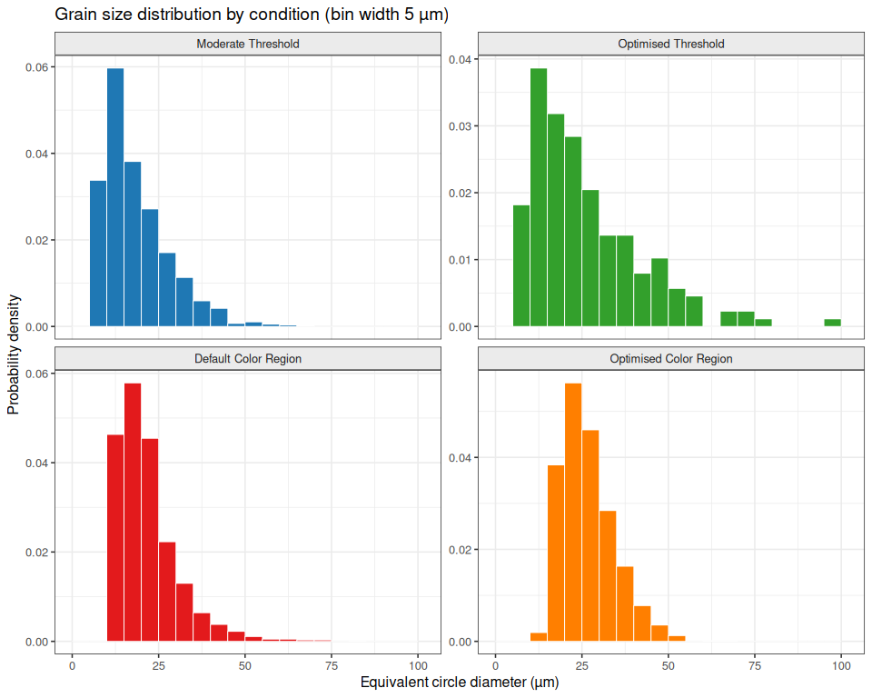
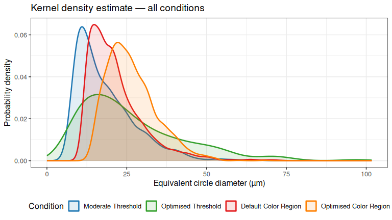
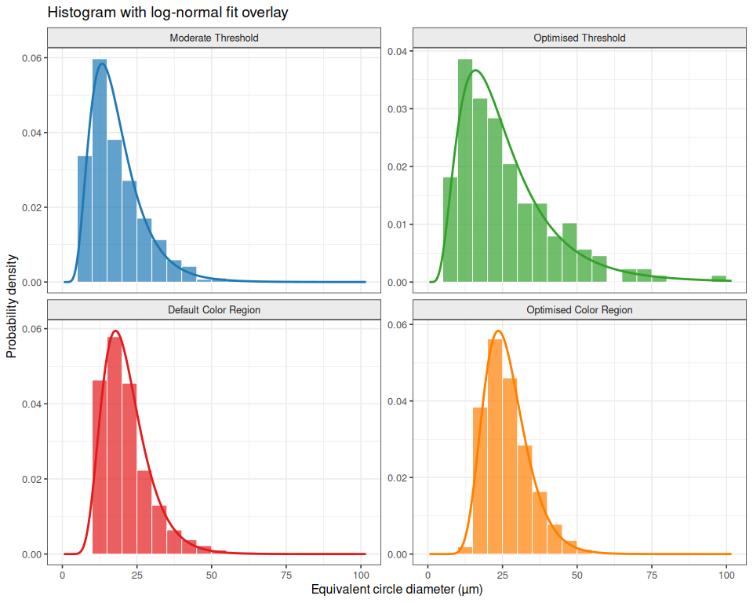
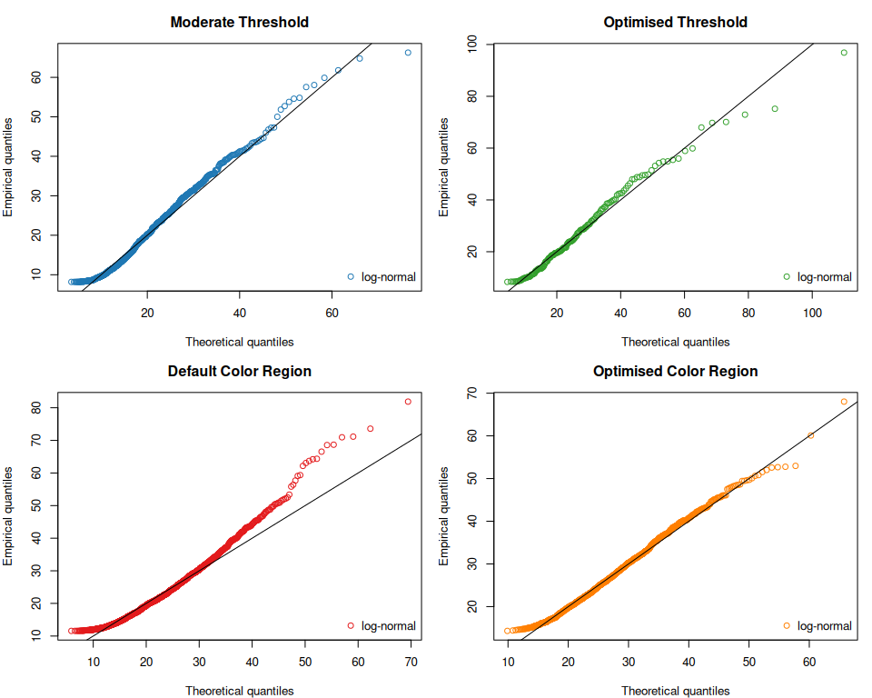

# Grain Detection Parameter Comparison: 20260408_C2600-06tx200_s
yoshinobu.ishizaki
2026-04-15

- [Overview](#overview)
- [Conclusion](#conclusion)
- [Preparation](#preparation)
- [Original Image](#original-image)
- [Overlay Image Comparison](#overlay-image-comparison)
- [Analysis Parameters](#analysis-parameters)
- [Grain Size Statistics](#grain-size-statistics)
- [Grain Size Distribution](#grain-size-distribution)
  - [Histogram (density scale)](#histogram-density-scale)
  - [Density overlay](#density-overlay)
- [Log-Normal Distribution Fitting](#log-normal-distribution-fitting)
  - [Fit parameters and
    goodness-of-fit](#fit-parameters-and-goodness-of-fit)
  - [Fit overlay — lognormal density on
    histogram](#fit-overlay--lognormal-density-on-histogram)
  - [Q-Q plots (log-normal)](#q-q-plots-log-normal)

## Overview

This document compares three grain-detection parameter configurations
applied to the same brass microstructure image
(`20260408_C2600-06tx200_s.jpg`, C2600 un-annealed, ×200). A fourth
condition (Optimised Threshold) is planned for a future update pending
optimizer completion.

| \# | Condition | Detection method |
|----|----|----|
| 1 | Moderate Threshold | GSAT pipeline — adaptive threshold, CLAHE clip=2, denoise_h=0.1, invert=true |
| 2 | Optimised Threshold | GSAT pipeline — auto-optimised via random search (seed 42, starting from moderate params) |
| 3 | Default Color Region | Felzenszwalb — scale = 200, sigma = 0.8, min_size = 100 |
| 4 | Optimised Color Region | Felzenszwalb — auto-optimised via random search (seed 42) |

All conditions share the same image ROI (`x=0, y=191, w=1439, h=603`),
scale factor (`pixels_per_um = 0.975`), and grain-filtering settings
(`min_grain_area = 50 px²`, `exclude_edge_grains = true`).

------------------------------------------------------------------------

## Conclusion

Visually, **Default Color Region** (Felzenszwalb, scale=200, sigma=0.8,
min_size=100) produced the most convincing grain boundary detection for
this image. The 2064 detected grains align well with the visible
microstructure, and the overlay shows clean, continuous boundaries that
closely follow the actual grain outlines.

Key findings:

- The **threshold pipeline** requires non-default settings to work at
  all on this image (`invert_grayscale=true`, gentle denoising, adaptive
  thresholding). Even with moderate tuning it detects fewer
  grains (1149) than the color-region methods. The optimiser converged
  to only 176 grains — evidence that the threshold approach struggles
  with the low boundary-to-grain contrast of this brass micrograph.
- The **color-region pipeline** (Felzenszwalb) works well
  out-of-the-box. The default settings yielded the highest grain
  count (2064) and visually the best-looking overlay. Optimisation
  shifted the parameters toward a coarser segmentation (scale=100,
  sigma=0.3) resulting in 1470 grains with a slightly larger mean
  diameter.
- **Log-normal distribution** provided a good fit for all conditions
  (AIC minimum = **Optimised Threshold**), consistent with the expected
  grain-size distribution in polycrystalline metals.

**Recommendation**: Use Default Color Region as the starting point for
this sample type. Apply the optimiser only if the default segmentation
visually over- or under-segments the boundaries for a given image.

------------------------------------------------------------------------

## Preparation

The CSV data and overlay images below were generated with the following
commands (run from repo root):

``` bash
# Run all from tests/sample/param_comp/

# Condition 1: moderate threshold
uv run ../../../src/grainsize_measure_cli.py param_cmp_moderate_threshold.json \
  --out grain chord stat image --oname cmp_moderate_threshold

# Condition 2: optimised threshold
uv run ../../../scripts/optimize_params.py \
  --params param_cmp_moderate_threshold.json \
  --out param_cmp_opt_threshold.json --seed 42
uv run ../../../src/grainsize_measure_cli.py param_cmp_opt_threshold.json \
  --out grain chord stat image --oname cmp_opt_threshold

# Condition 3: default color region
uv run ../../../src/grainsize_measure_cli.py param_cmp_default_color.json \
  --out grain chord stat image --oname cmp_default_color

# Condition 4: optimised color region
uv run ../../../scripts/optimize_params.py \
  --params param_cmp_default_color.json \
  --out param_cmp_opt_color.json --seed 42
uv run ../../../src/grainsize_measure_cli.py param_cmp_opt_color.json \
  --out grain chord stat image --oname cmp_opt_color
```

------------------------------------------------------------------------

## Original Image


------------------------------------------------------------------------

## Overlay Image Comparison

| Moderate Threshold | Optimised Threshold |
|:--:|:--:|
|  |  |

| Default Color Region | Optimised Color Region |
|:--:|:--:|
|  |  |

------------------------------------------------------------------------

## Analysis Parameters

| Parameter | Moderate Threshold | Optimised Threshold | Default Color Region | Optimised Color Region |
|:---|:--:|:--:|:--:|:--:|
| Detection method | threshold | threshold | color_region | color_region |
| Threshold method | adaptive_threshold | global_threshold | — | — |
| Threshold value | 128 | 100 | — | — |
| Threshold high | 200 | 180 | — | — |
| Adaptive block size | 35 | 21 | — | — |
| CLAHE clip limit | 2 | 5 | — | — |
| Denoise h | 0.1 | 10 | — | — |
| Sharpen amount | 0.5 | 0.3 | — | — |
| Morph close radius (px) | 1 | 0 | — | — |
| Morph open radius (px) | 0 | 2 | — | — |
| Min feature size (px²) | 50 | 100 | — | — |
| Color scale | — | — | 200 | 100 |
| Color sigma | — | — | 0.8 | 0.3 |
| Color min size (px²) | — | — | 100 | 150 |
| Color morph close radius (px) | — | — | 0 | 0 |

------------------------------------------------------------------------

## Grain Size Statistics

| Statistic | Moderate Threshold | Optimised Threshold | Default Color Region | Optimised Color Region |
|:---|---:|---:|---:|---:|
| N (grains) | 1149.00 | 176.00 | 2064.00 | 1470.00 |
| Mean diam (µm) | 18.42 | 26.35 | 21.60 | 26.54 |
| Median (µm) | 15.66 | 21.51 | 19.64 | 25.29 |
| SD (µm) | 9.38 | 16.08 | 8.85 | 7.71 |
| CV (%) | 50.90 | 61.04 | 40.97 | 29.04 |
| Min diam (µm) | 8.18 | 8.35 | 11.57 | 14.32 |
| Max diam (µm) | 66.27 | 96.87 | 81.88 | 68.03 |
| Mean area (µm²) | 335.63 | 747.12 | 428.09 | 599.77 |

------------------------------------------------------------------------

## Grain Size Distribution

### Histogram (density scale)



### Density overlay



------------------------------------------------------------------------

## Log-Normal Distribution Fitting

Log-normal maximum-likelihood fits were computed with
`fitdistrplus::fitdist()`.

### Fit parameters and goodness-of-fit

<div id="xrjghxfdqo" style="padding-left:0px;padding-right:0px;padding-top:10px;padding-bottom:10px;overflow-x:auto;overflow-y:auto;width:auto;height:auto;">
<style>#xrjghxfdqo table {
  font-family: system-ui, 'Segoe UI', Roboto, Helvetica, Arial, sans-serif, 'Apple Color Emoji', 'Segoe UI Emoji', 'Segoe UI Symbol', 'Noto Color Emoji';
  -webkit-font-smoothing: antialiased;
  -moz-osx-font-smoothing: grayscale;
}
&#10;#xrjghxfdqo thead, #xrjghxfdqo tbody, #xrjghxfdqo tfoot, #xrjghxfdqo tr, #xrjghxfdqo td, #xrjghxfdqo th {
  border-style: none;
}
&#10;#xrjghxfdqo p {
  margin: 0;
  padding: 0;
}
&#10;#xrjghxfdqo .gt_table {
  display: table;
  border-collapse: collapse;
  line-height: normal;
  margin-left: auto;
  margin-right: auto;
  color: #333333;
  font-size: 16px;
  font-weight: normal;
  font-style: normal;
  background-color: #FFFFFF;
  width: auto;
  border-top-style: solid;
  border-top-width: 2px;
  border-top-color: #A8A8A8;
  border-right-style: none;
  border-right-width: 2px;
  border-right-color: #D3D3D3;
  border-bottom-style: solid;
  border-bottom-width: 2px;
  border-bottom-color: #A8A8A8;
  border-left-style: none;
  border-left-width: 2px;
  border-left-color: #D3D3D3;
}
&#10;#xrjghxfdqo .gt_caption {
  padding-top: 4px;
  padding-bottom: 4px;
}
&#10;#xrjghxfdqo .gt_title {
  color: #333333;
  font-size: 125%;
  font-weight: initial;
  padding-top: 4px;
  padding-bottom: 4px;
  padding-left: 5px;
  padding-right: 5px;
  border-bottom-color: #FFFFFF;
  border-bottom-width: 0;
}
&#10;#xrjghxfdqo .gt_subtitle {
  color: #333333;
  font-size: 85%;
  font-weight: initial;
  padding-top: 3px;
  padding-bottom: 5px;
  padding-left: 5px;
  padding-right: 5px;
  border-top-color: #FFFFFF;
  border-top-width: 0;
}
&#10;#xrjghxfdqo .gt_heading {
  background-color: #FFFFFF;
  text-align: center;
  border-bottom-color: #FFFFFF;
  border-left-style: none;
  border-left-width: 1px;
  border-left-color: #D3D3D3;
  border-right-style: none;
  border-right-width: 1px;
  border-right-color: #D3D3D3;
}
&#10;#xrjghxfdqo .gt_bottom_border {
  border-bottom-style: solid;
  border-bottom-width: 2px;
  border-bottom-color: #D3D3D3;
}
&#10;#xrjghxfdqo .gt_col_headings {
  border-top-style: solid;
  border-top-width: 2px;
  border-top-color: #D3D3D3;
  border-bottom-style: solid;
  border-bottom-width: 2px;
  border-bottom-color: #D3D3D3;
  border-left-style: none;
  border-left-width: 1px;
  border-left-color: #D3D3D3;
  border-right-style: none;
  border-right-width: 1px;
  border-right-color: #D3D3D3;
}
&#10;#xrjghxfdqo .gt_col_heading {
  color: #333333;
  background-color: #FFFFFF;
  font-size: 100%;
  font-weight: bold;
  text-transform: inherit;
  border-left-style: none;
  border-left-width: 1px;
  border-left-color: #D3D3D3;
  border-right-style: none;
  border-right-width: 1px;
  border-right-color: #D3D3D3;
  vertical-align: bottom;
  padding-top: 5px;
  padding-bottom: 6px;
  padding-left: 5px;
  padding-right: 5px;
  overflow-x: hidden;
}
&#10;#xrjghxfdqo .gt_column_spanner_outer {
  color: #333333;
  background-color: #FFFFFF;
  font-size: 100%;
  font-weight: bold;
  text-transform: inherit;
  padding-top: 0;
  padding-bottom: 0;
  padding-left: 4px;
  padding-right: 4px;
}
&#10;#xrjghxfdqo .gt_column_spanner_outer:first-child {
  padding-left: 0;
}
&#10;#xrjghxfdqo .gt_column_spanner_outer:last-child {
  padding-right: 0;
}
&#10;#xrjghxfdqo .gt_column_spanner {
  border-bottom-style: solid;
  border-bottom-width: 2px;
  border-bottom-color: #D3D3D3;
  vertical-align: bottom;
  padding-top: 5px;
  padding-bottom: 5px;
  overflow-x: hidden;
  display: inline-block;
  width: 100%;
}
&#10;#xrjghxfdqo .gt_spanner_row {
  border-bottom-style: hidden;
}
&#10;#xrjghxfdqo .gt_group_heading {
  padding-top: 8px;
  padding-bottom: 8px;
  padding-left: 5px;
  padding-right: 5px;
  color: #333333;
  background-color: #FFFFFF;
  font-size: 100%;
  font-weight: initial;
  text-transform: inherit;
  border-top-style: solid;
  border-top-width: 2px;
  border-top-color: #D3D3D3;
  border-bottom-style: solid;
  border-bottom-width: 2px;
  border-bottom-color: #D3D3D3;
  border-left-style: none;
  border-left-width: 1px;
  border-left-color: #D3D3D3;
  border-right-style: none;
  border-right-width: 1px;
  border-right-color: #D3D3D3;
  vertical-align: middle;
  text-align: left;
}
&#10;#xrjghxfdqo .gt_empty_group_heading {
  padding: 0.5px;
  color: #333333;
  background-color: #FFFFFF;
  font-size: 100%;
  font-weight: initial;
  border-top-style: solid;
  border-top-width: 2px;
  border-top-color: #D3D3D3;
  border-bottom-style: solid;
  border-bottom-width: 2px;
  border-bottom-color: #D3D3D3;
  vertical-align: middle;
}
&#10;#xrjghxfdqo .gt_from_md > :first-child {
  margin-top: 0;
}
&#10;#xrjghxfdqo .gt_from_md > :last-child {
  margin-bottom: 0;
}
&#10;#xrjghxfdqo .gt_row {
  padding-top: 8px;
  padding-bottom: 8px;
  padding-left: 5px;
  padding-right: 5px;
  margin: 10px;
  border-top-style: solid;
  border-top-width: 1px;
  border-top-color: #D3D3D3;
  border-left-style: none;
  border-left-width: 1px;
  border-left-color: #D3D3D3;
  border-right-style: none;
  border-right-width: 1px;
  border-right-color: #D3D3D3;
  vertical-align: middle;
  overflow-x: hidden;
}
&#10;#xrjghxfdqo .gt_stub {
  color: #333333;
  background-color: #FFFFFF;
  font-size: 100%;
  font-weight: bold;
  text-transform: inherit;
  border-right-style: solid;
  border-right-width: 2px;
  border-right-color: #D3D3D3;
  padding-left: 5px;
  padding-right: 5px;
}
&#10;#xrjghxfdqo .gt_stub_row_group {
  color: #333333;
  background-color: #FFFFFF;
  font-size: 100%;
  font-weight: initial;
  text-transform: inherit;
  border-right-style: solid;
  border-right-width: 2px;
  border-right-color: #D3D3D3;
  padding-left: 5px;
  padding-right: 5px;
  vertical-align: top;
}
&#10;#xrjghxfdqo .gt_row_group_first td {
  border-top-width: 2px;
}
&#10;#xrjghxfdqo .gt_row_group_first th {
  border-top-width: 2px;
}
&#10;#xrjghxfdqo .gt_summary_row {
  color: #333333;
  background-color: #FFFFFF;
  text-transform: inherit;
  padding-top: 8px;
  padding-bottom: 8px;
  padding-left: 5px;
  padding-right: 5px;
}
&#10;#xrjghxfdqo .gt_first_summary_row {
  border-top-style: solid;
  border-top-color: #D3D3D3;
}
&#10;#xrjghxfdqo .gt_first_summary_row.thick {
  border-top-width: 2px;
}
&#10;#xrjghxfdqo .gt_last_summary_row {
  padding-top: 8px;
  padding-bottom: 8px;
  padding-left: 5px;
  padding-right: 5px;
  border-bottom-style: solid;
  border-bottom-width: 2px;
  border-bottom-color: #D3D3D3;
}
&#10;#xrjghxfdqo .gt_grand_summary_row {
  color: #333333;
  background-color: #FFFFFF;
  text-transform: inherit;
  padding-top: 8px;
  padding-bottom: 8px;
  padding-left: 5px;
  padding-right: 5px;
}
&#10;#xrjghxfdqo .gt_first_grand_summary_row {
  padding-top: 8px;
  padding-bottom: 8px;
  padding-left: 5px;
  padding-right: 5px;
  border-top-style: double;
  border-top-width: 6px;
  border-top-color: #D3D3D3;
}
&#10;#xrjghxfdqo .gt_last_grand_summary_row_top {
  padding-top: 8px;
  padding-bottom: 8px;
  padding-left: 5px;
  padding-right: 5px;
  border-bottom-style: double;
  border-bottom-width: 6px;
  border-bottom-color: #D3D3D3;
}
&#10;#xrjghxfdqo .gt_striped {
  background-color: rgba(128, 128, 128, 0.05);
}
&#10;#xrjghxfdqo .gt_table_body {
  border-top-style: solid;
  border-top-width: 2px;
  border-top-color: #D3D3D3;
  border-bottom-style: solid;
  border-bottom-width: 2px;
  border-bottom-color: #D3D3D3;
}
&#10;#xrjghxfdqo .gt_footnotes {
  color: #333333;
  background-color: #FFFFFF;
  border-bottom-style: none;
  border-bottom-width: 2px;
  border-bottom-color: #D3D3D3;
  border-left-style: none;
  border-left-width: 2px;
  border-left-color: #D3D3D3;
  border-right-style: none;
  border-right-width: 2px;
  border-right-color: #D3D3D3;
}
&#10;#xrjghxfdqo .gt_footnote {
  margin: 0px;
  font-size: 90%;
  padding-top: 4px;
  padding-bottom: 4px;
  padding-left: 5px;
  padding-right: 5px;
}
&#10;#xrjghxfdqo .gt_sourcenotes {
  color: #333333;
  background-color: #FFFFFF;
  border-bottom-style: none;
  border-bottom-width: 2px;
  border-bottom-color: #D3D3D3;
  border-left-style: none;
  border-left-width: 2px;
  border-left-color: #D3D3D3;
  border-right-style: none;
  border-right-width: 2px;
  border-right-color: #D3D3D3;
}
&#10;#xrjghxfdqo .gt_sourcenote {
  font-size: 90%;
  padding-top: 4px;
  padding-bottom: 4px;
  padding-left: 5px;
  padding-right: 5px;
}
&#10;#xrjghxfdqo .gt_left {
  text-align: left;
}
&#10;#xrjghxfdqo .gt_center {
  text-align: center;
}
&#10;#xrjghxfdqo .gt_right {
  text-align: right;
  font-variant-numeric: tabular-nums;
}
&#10;#xrjghxfdqo .gt_font_normal {
  font-weight: normal;
}
&#10;#xrjghxfdqo .gt_font_bold {
  font-weight: bold;
}
&#10;#xrjghxfdqo .gt_font_italic {
  font-style: italic;
}
&#10;#xrjghxfdqo .gt_super {
  font-size: 65%;
}
&#10;#xrjghxfdqo .gt_footnote_marks {
  font-size: 75%;
  vertical-align: 0.4em;
  position: initial;
}
&#10;#xrjghxfdqo .gt_asterisk {
  font-size: 100%;
  vertical-align: 0;
}
&#10;#xrjghxfdqo .gt_indent_1 {
  text-indent: 5px;
}
&#10;#xrjghxfdqo .gt_indent_2 {
  text-indent: 10px;
}
&#10;#xrjghxfdqo .gt_indent_3 {
  text-indent: 15px;
}
&#10;#xrjghxfdqo .gt_indent_4 {
  text-indent: 20px;
}
&#10;#xrjghxfdqo .gt_indent_5 {
  text-indent: 25px;
}
&#10;#xrjghxfdqo .katex-display {
  display: inline-flex !important;
  margin-bottom: 0.75em !important;
}
&#10;#xrjghxfdqo div.Reactable > div.rt-table > div.rt-thead > div.rt-tr.rt-tr-group-header > div.rt-th-group:after {
  height: 0px !important;
}
</style>

<table class="gt_table" style="width:100%;"
data-quarto-postprocess="true" data-quarto-disable-processing="false"
data-quarto-bootstrap="false">
<colgroup>
<col style="width: 16%" />
<col style="width: 16%" />
<col style="width: 16%" />
<col style="width: 16%" />
<col style="width: 16%" />
<col style="width: 16%" />
</colgroup>
<thead>
<tr class="gt_heading">
<th colspan="6"
class="gt_heading gt_title gt_font_normal gt_bottom_border">Log-normal
fit parameters and information criteria</th>
</tr>
<tr class="gt_col_headings gt_spanner_row">
<th rowspan="2" id="a::stub"
class="gt_col_heading gt_columns_bottom_border gt_left"
data-quarto-table-cell-role="th" scope="col"></th>
<th colspan="2" id="Log-normal parameters"
class="gt_center gt_columns_top_border gt_column_spanner_outer"
data-quarto-table-cell-role="th" scope="colgroup"><div
class="gt_column_spanner">
Log-normal parameters
</div></th>
<th colspan="2" id="Goodness of fit"
class="gt_center gt_columns_top_border gt_column_spanner_outer"
data-quarto-table-cell-role="th" scope="colgroup"><div
class="gt_column_spanner">
Goodness of fit
</div></th>
<th rowspan="2" id="Method"
class="gt_col_heading gt_columns_bottom_border gt_left"
data-quarto-table-cell-role="th" scope="col">Detection method</th>
</tr>
<tr class="gt_col_headings">
<th id="meanlog"
class="gt_col_heading gt_columns_bottom_border gt_right"
data-quarto-table-cell-role="th" scope="col">meanlog</th>
<th id="sdlog" class="gt_col_heading gt_columns_bottom_border gt_right"
data-quarto-table-cell-role="th" scope="col">sdlog</th>
<th id="AIC" class="gt_col_heading gt_columns_bottom_border gt_right"
data-quarto-table-cell-role="th" scope="col">AIC<span
class="gt_footnote_marks"
style="white-space:nowrap;font-style:italic;font-weight:normal;line-height:0;"><sup>1</sup></span></th>
<th id="BIC" class="gt_col_heading gt_columns_bottom_border gt_right"
data-quarto-table-cell-role="th" scope="col">BIC</th>
</tr>
</thead>
<tbody class="gt_table_body">
<tr>
<td id="stub_1_1" class="gt_row gt_left gt_stub"
data-quarto-table-cell-role="th" scope="row">Moderate Threshold</td>
<td class="gt_row gt_right" headers="stub_1_1 meanlog">2.8023</td>
<td class="gt_row gt_right" headers="stub_1_1 sdlog">0.4609</td>
<td class="gt_row gt_right" headers="stub_1_1 AIC">7924.8</td>
<td class="gt_row gt_right" headers="stub_1_1 BIC">7934.9</td>
<td class="gt_row gt_left" headers="stub_1_1 Method">threshold</td>
</tr>
<tr>
<td id="stub_1_2" class="gt_row gt_left gt_stub"
data-quarto-table-cell-role="th" scope="row">Optimised Threshold</td>
<td class="gt_row gt_right" headers="stub_1_2 meanlog">3.1033</td>
<td class="gt_row gt_right" headers="stub_1_2 sdlog">0.5774</td>
<td class="gt_row gt_right" headers="stub_1_2 AIC"
style="color: #00ACC1; font-weight: bold">1402.5</td>
<td class="gt_row gt_right" headers="stub_1_2 BIC">1408.9</td>
<td class="gt_row gt_left" headers="stub_1_2 Method">threshold</td>
</tr>
<tr>
<td id="stub_1_3" class="gt_row gt_left gt_stub"
data-quarto-table-cell-role="th" scope="row">Default Color Region</td>
<td class="gt_row gt_right" headers="stub_1_3 meanlog">3.0052</td>
<td class="gt_row gt_right" headers="stub_1_3 sdlog">0.3540</td>
<td class="gt_row gt_right" headers="stub_1_3 AIC">13979.9</td>
<td class="gt_row gt_right" headers="stub_1_3 BIC">13991.2</td>
<td class="gt_row gt_left" headers="stub_1_3 Method">color_region</td>
</tr>
<tr>
<td id="stub_1_4" class="gt_row gt_left gt_stub"
data-quarto-table-cell-role="th" scope="row">Optimised Color Region</td>
<td class="gt_row gt_right" headers="stub_1_4 meanlog">3.2391</td>
<td class="gt_row gt_right" headers="stub_1_4 sdlog">0.2788</td>
<td class="gt_row gt_right" headers="stub_1_4 AIC">9943.0</td>
<td class="gt_row gt_right" headers="stub_1_4 BIC">9953.6</td>
<td class="gt_row gt_left" headers="stub_1_4 Method">color_region</td>
</tr>
</tbody><tfoot>
<tr class="gt_footnotes">
<td colspan="6" class="gt_footnote"><span class="gt_footnote_marks"
style="white-space:nowrap;font-style:italic;font-weight:normal;line-height:0;"><sup>1</sup></span>
Highlighted cell = lowest AIC (best log-normal fit).</td>
</tr>
</tfoot>
&#10;</table>

</div>

### Fit overlay — lognormal density on histogram



### Q-Q plots (log-normal)


