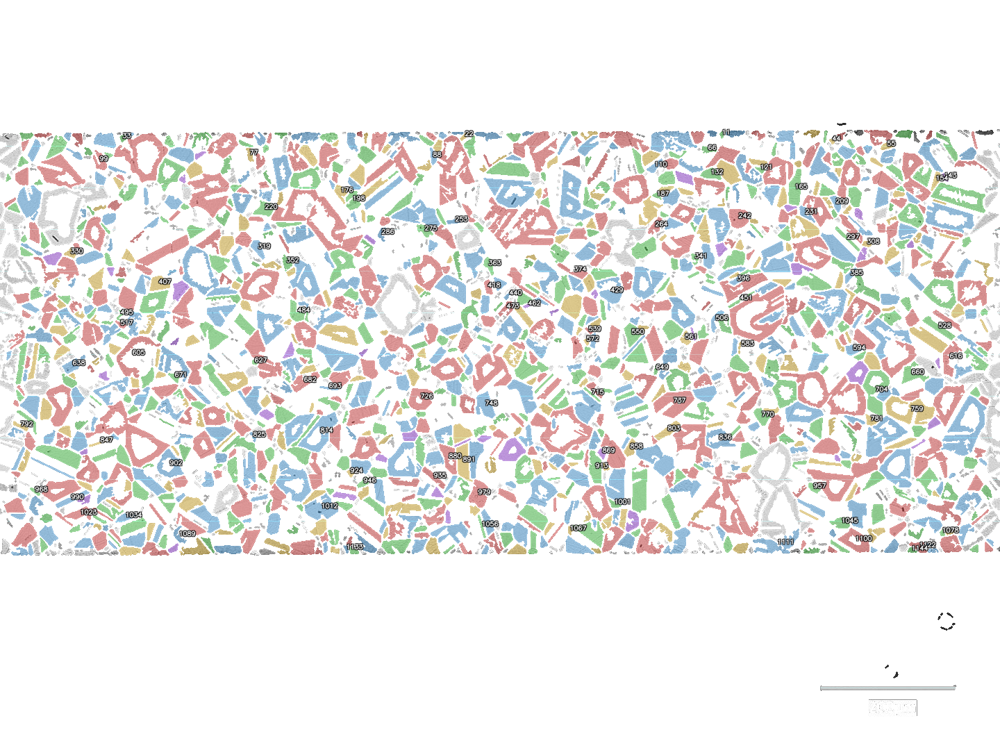
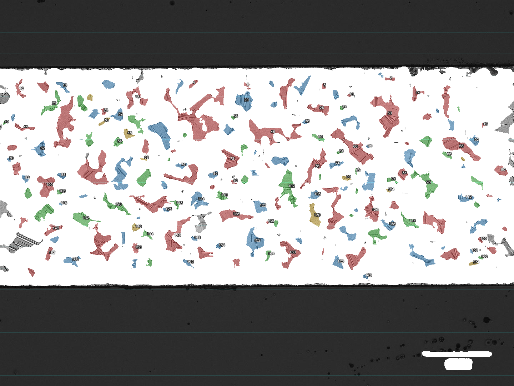
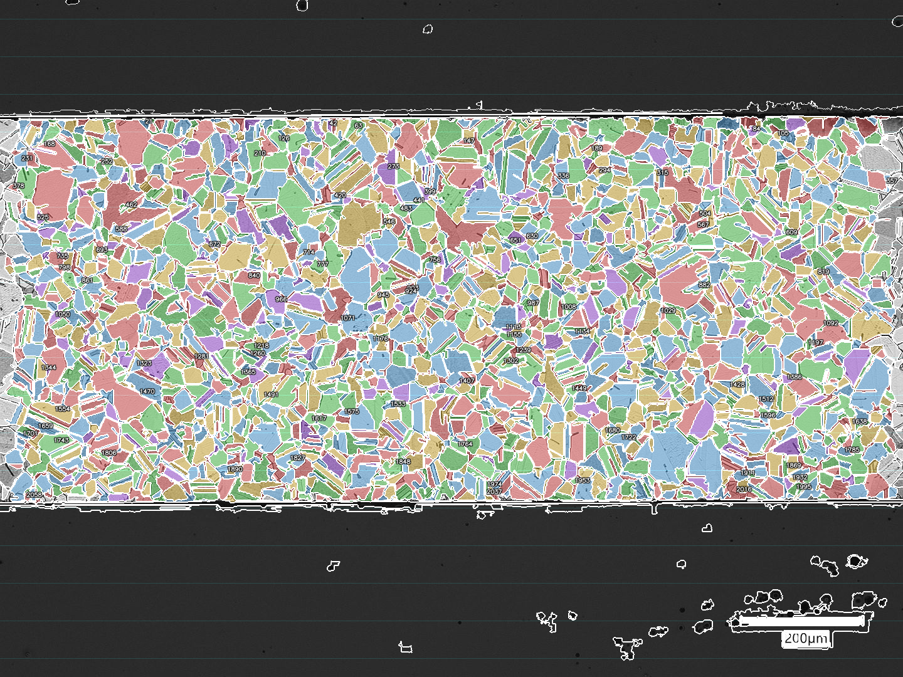
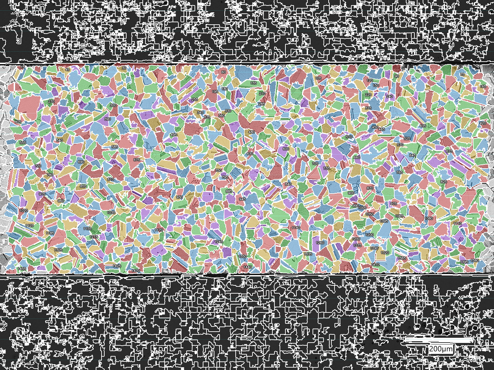
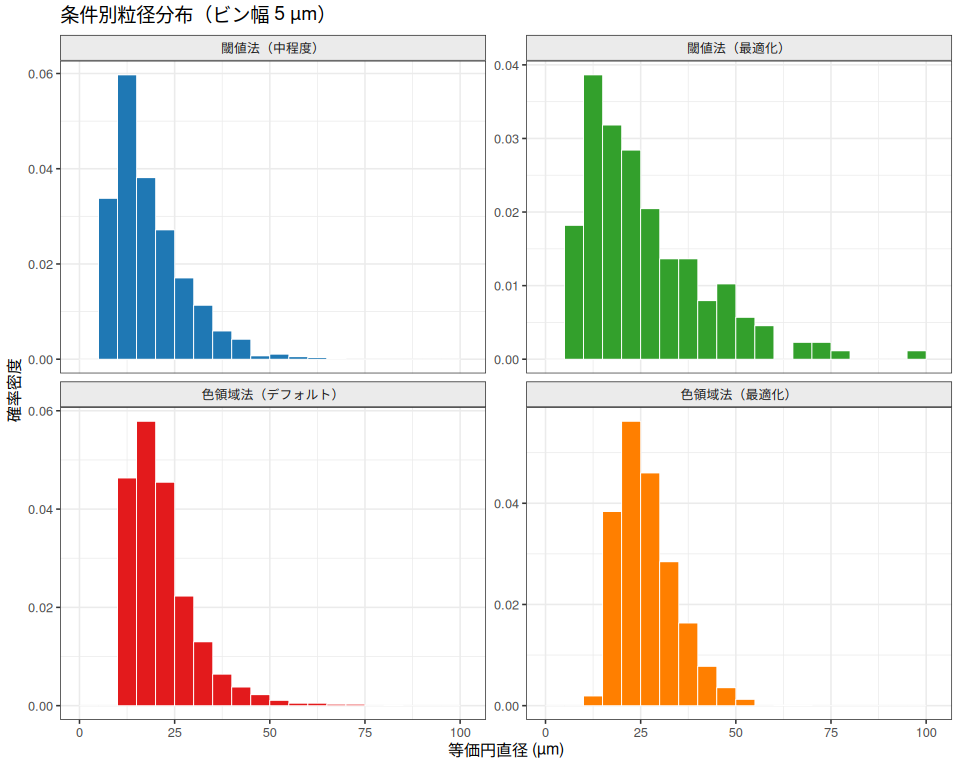
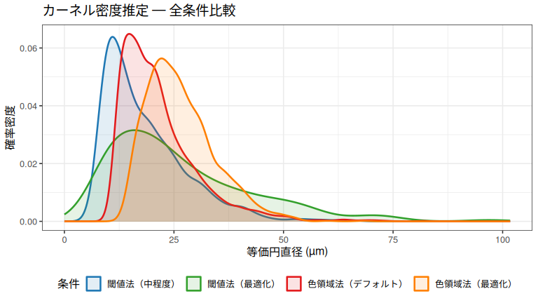
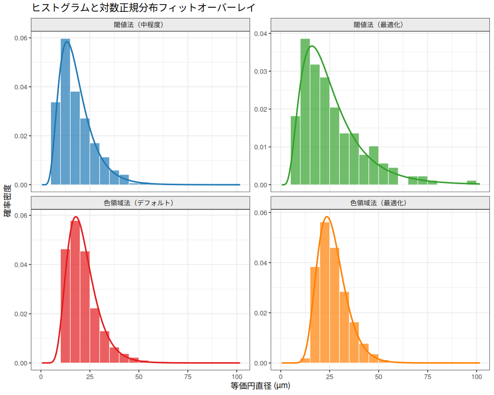
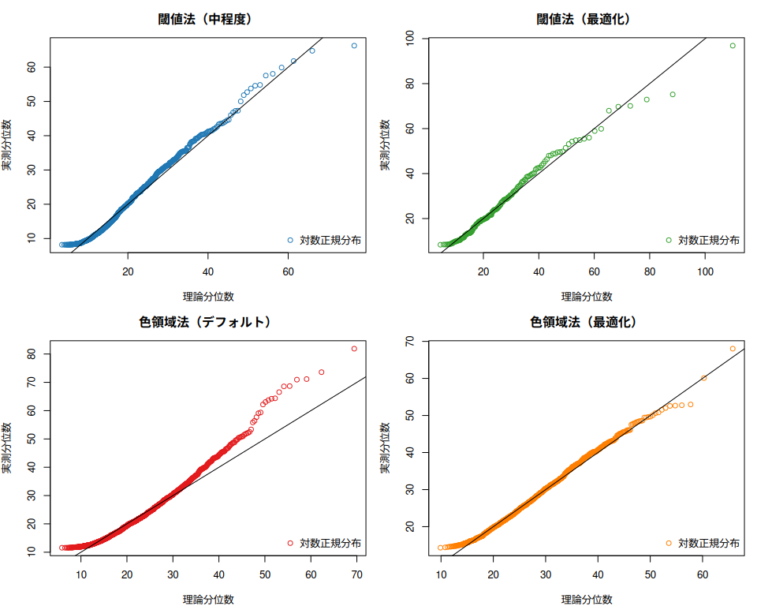

# 結晶粒検出パラメータ比較: 20260408_C2600-06tx200_s
yoshinobu.ishizaki
2026-04-15

- [概要](#概要)
- [結論](#結論)
- [解析手順](#解析手順)
- [オリジナル画像](#オリジナル画像)
- [オーバーレイ画像の比較](#オーバーレイ画像の比較)
- [解析パラメータ](#解析パラメータ)
- [記述統計](#記述統計)
- [粒径分布](#粒径分布)
  - [ヒストグラム（確率密度）](#ヒストグラム確率密度)
  - [確率密度の比較](#確率密度の比較)
- [対数正規分布フィッティング](#対数正規分布フィッティング)
  - [フィットパラメータと適合度指標](#フィットパラメータと適合度指標)
  - [フィットオーバーレイ —
    対数正規分布密度](#フィットオーバーレイ--対数正規分布密度)
  - [Q-Qプロット（対数正規分布）](#q-qプロット対数正規分布)

## 概要

本ドキュメントでは、同一の真鍮ミクロ組織画像（`20260408_C2600-06tx200_s.jpg`、C2600
未熱処理、×200）に 対して4種類の結晶粒検出パラメータ設定を比較する。

| \# | 条件 | 検出手法 |
|----|----|----|
| 1 | 閾値法（中程度） | GSATパイプライン — 適応閾値、CLAHE clip=2、denoise_h=0.1、反転あり |
| 2 | 閾値法（最適化） | GSATパイプライン — ランダム探索で自動最適化（seed 42、中程度設定を起点） |
| 3 | 色領域法（デフォルト） | Felzenszwalb — scale=200、sigma=0.8、min_size=100 |
| 4 | 色領域法（最適化） | Felzenszwalb — ランダム探索で自動最適化（seed 42） |

全条件で共通設定：ROI（x=0、y=191、w=1439、h=603）、スケール（pixels_per_um=0.975）、
粒子フィルタ（min_grain_area=50 px²、exclude_edge_grains=true）。

------------------------------------------------------------------------

## 結論

目視確認の結果、**色領域法（デフォルト）**（Felzenszwalb、scale=200、sigma=0.8、min_size=100）が
今回の画像に対して最も自然な粒界検出を示した。
2064粒の検出数はミクロ組織の実際の粒構造と整合しており、オーバーレイ画像では
粒界輪郭に沿った連続的で明瞭な境界線が確認できる。

主な知見：

- **閾値法**はこの画像に対してデフォルト設定では機能しない（`invert_grayscale=true`、
  軽いノイズ除去、適応閾値化が必須）。中程度設定で1149粒を検出できるが、
  最適化後は176粒にとどまり、低コントラスト粒界を持つ真鍮ミクロ組織への適合性に限界がある。
- **色領域法**は設定調整なしで良好に機能する。デフォルト設定が最も多くの粒（2064粒）を検出し、
  目視でも最良のオーバーレイを示した。最適化によりパラメータが粗粒化方向（scale=100、sigma=0.3）
  にシフトし、1470粒・わずかに大きな平均径となった。
- **対数正規分布**は全条件で良好なフィット（AIC最小：**閾値法（最適化）**）を示し、
  多結晶金属の粒径分布として一般に期待される結果と一致する。

**推奨**：このサンプルタイプには色領域法（デフォルト）を出発点として使用すること。
デフォルト設定で目視上の過剰・過少分割が生じる場合のみ最適化を実施する。

------------------------------------------------------------------------

## 解析手順

以下のコマンドで各条件のCSVデータとオーバーレイ画像を生成する（`tests/sample/param_comp/`
から実行）：

``` bash
# 条件1: 閾値法（中程度）
uv run ../../../src/grainsize_measure_cli.py param_cmp_moderate_threshold.json \
  --out grain chord stat image --oname cmp_moderate_threshold

# 条件2: 閾値法（最適化）
uv run ../../../scripts/optimize_params.py \
  --params param_cmp_moderate_threshold.json \
  --out param_cmp_opt_threshold.json --seed 42
uv run ../../../src/grainsize_measure_cli.py param_cmp_opt_threshold.json \
  --out grain chord stat image --oname cmp_opt_threshold

# 条件3: 色領域法（デフォルト）
uv run ../../../src/grainsize_measure_cli.py param_cmp_default_color.json \
  --out grain chord stat image --oname cmp_default_color

# 条件4: 色領域法（最適化）
uv run ../../../scripts/optimize_params.py \
  --params param_cmp_default_color.json \
  --out param_cmp_opt_color.json --seed 42
uv run ../../../src/grainsize_measure_cli.py param_cmp_opt_color.json \
  --out grain chord stat image --oname cmp_opt_color
```

------------------------------------------------------------------------

## オリジナル画像


------------------------------------------------------------------------

## オーバーレイ画像の比較

| 閾値法（中程度） | 閾値法（最適化） |
|:--:|:--:|
|  |  |

| 色領域法（デフォルト） | 色領域法（最適化） |
|:--:|:--:|
|  |  |

------------------------------------------------------------------------

## 解析パラメータ

| パラメータ | 閾値法（中程度） | 閾値法（最適化） | 色領域法（デフォルト） | 色領域法（最適化） |
|:---|:--:|:--:|:--:|:--:|
| 検出手法 | threshold | threshold | color_region | color_region |
| 閾値化手法 | adaptive_threshold | global_threshold | — | — |
| 閾値 | 128 | 100 | — | — |
| 上限閾値 | 200 | 180 | — | — |
| 適応ブロックサイズ | 35 | 21 | — | — |
| CLAHEクリップ上限 | 2 | 5 | — | — |
| ノイズ除去 h | 0.1 | 10 | — | — |
| シャープ化量 | 0.5 | 0.3 | — | — |
| モルフォロジー閉演算半径 (px) | 1 | 0 | — | — |
| モルフォロジー開演算半径 (px) | 0 | 2 | — | — |
| 最小特徴サイズ (px²) | 50 | 100 | — | — |
| 色スケール | — | — | 200 | 100 |
| 色シグマ | — | — | 0.8 | 0.3 |
| 色最小サイズ (px²) | — | — | 100 | 150 |
| 色モルフォロジー閉演算半径 (px) | — | — | 0 | 0 |

------------------------------------------------------------------------

## 記述統計

| 統計量 | 閾値法（中程度） | 閾値法（最適化） | 色領域法（デフォルト） | 色領域法（最適化） |
|:---|---:|---:|---:|---:|
| 粒数 | 1149.00 | 176.00 | 2064.00 | 1470.00 |
| 平均径 (µm) | 18.42 | 26.35 | 21.60 | 26.54 |
| 中央値 (µm) | 15.66 | 21.51 | 19.64 | 25.29 |
| 標準偏差 (µm) | 9.38 | 16.08 | 8.85 | 7.71 |
| 変動係数 (%) | 50.90 | 61.04 | 40.97 | 29.04 |
| 最小径 (µm) | 8.18 | 8.35 | 11.57 | 14.32 |
| 最大径 (µm) | 66.27 | 96.87 | 81.88 | 68.03 |
| 平均面積 (µm²) | 335.63 | 747.12 | 428.09 | 599.77 |

------------------------------------------------------------------------

## 粒径分布

### ヒストグラム（確率密度）



### 確率密度の比較



------------------------------------------------------------------------

## 対数正規分布フィッティング

`fitdistrplus::fitdist()` による対数正規分布の最尤推定を実施した。

### フィットパラメータと適合度指標

<div id="xdbbjfirgj" style="padding-left:0px;padding-right:0px;padding-top:10px;padding-bottom:10px;overflow-x:auto;overflow-y:auto;width:auto;height:auto;">
<style>#xdbbjfirgj table {
  font-family: system-ui, 'Segoe UI', Roboto, Helvetica, Arial, sans-serif, 'Apple Color Emoji', 'Segoe UI Emoji', 'Segoe UI Symbol', 'Noto Color Emoji';
  -webkit-font-smoothing: antialiased;
  -moz-osx-font-smoothing: grayscale;
}
&#10;#xdbbjfirgj thead, #xdbbjfirgj tbody, #xdbbjfirgj tfoot, #xdbbjfirgj tr, #xdbbjfirgj td, #xdbbjfirgj th {
  border-style: none;
}
&#10;#xdbbjfirgj p {
  margin: 0;
  padding: 0;
}
&#10;#xdbbjfirgj .gt_table {
  display: table;
  border-collapse: collapse;
  line-height: normal;
  margin-left: auto;
  margin-right: auto;
  color: #333333;
  font-size: 16px;
  font-weight: normal;
  font-style: normal;
  background-color: #FFFFFF;
  width: auto;
  border-top-style: solid;
  border-top-width: 2px;
  border-top-color: #A8A8A8;
  border-right-style: none;
  border-right-width: 2px;
  border-right-color: #D3D3D3;
  border-bottom-style: solid;
  border-bottom-width: 2px;
  border-bottom-color: #A8A8A8;
  border-left-style: none;
  border-left-width: 2px;
  border-left-color: #D3D3D3;
}
&#10;#xdbbjfirgj .gt_caption {
  padding-top: 4px;
  padding-bottom: 4px;
}
&#10;#xdbbjfirgj .gt_title {
  color: #333333;
  font-size: 125%;
  font-weight: initial;
  padding-top: 4px;
  padding-bottom: 4px;
  padding-left: 5px;
  padding-right: 5px;
  border-bottom-color: #FFFFFF;
  border-bottom-width: 0;
}
&#10;#xdbbjfirgj .gt_subtitle {
  color: #333333;
  font-size: 85%;
  font-weight: initial;
  padding-top: 3px;
  padding-bottom: 5px;
  padding-left: 5px;
  padding-right: 5px;
  border-top-color: #FFFFFF;
  border-top-width: 0;
}
&#10;#xdbbjfirgj .gt_heading {
  background-color: #FFFFFF;
  text-align: center;
  border-bottom-color: #FFFFFF;
  border-left-style: none;
  border-left-width: 1px;
  border-left-color: #D3D3D3;
  border-right-style: none;
  border-right-width: 1px;
  border-right-color: #D3D3D3;
}
&#10;#xdbbjfirgj .gt_bottom_border {
  border-bottom-style: solid;
  border-bottom-width: 2px;
  border-bottom-color: #D3D3D3;
}
&#10;#xdbbjfirgj .gt_col_headings {
  border-top-style: solid;
  border-top-width: 2px;
  border-top-color: #D3D3D3;
  border-bottom-style: solid;
  border-bottom-width: 2px;
  border-bottom-color: #D3D3D3;
  border-left-style: none;
  border-left-width: 1px;
  border-left-color: #D3D3D3;
  border-right-style: none;
  border-right-width: 1px;
  border-right-color: #D3D3D3;
}
&#10;#xdbbjfirgj .gt_col_heading {
  color: #333333;
  background-color: #FFFFFF;
  font-size: 100%;
  font-weight: bold;
  text-transform: inherit;
  border-left-style: none;
  border-left-width: 1px;
  border-left-color: #D3D3D3;
  border-right-style: none;
  border-right-width: 1px;
  border-right-color: #D3D3D3;
  vertical-align: bottom;
  padding-top: 5px;
  padding-bottom: 6px;
  padding-left: 5px;
  padding-right: 5px;
  overflow-x: hidden;
}
&#10;#xdbbjfirgj .gt_column_spanner_outer {
  color: #333333;
  background-color: #FFFFFF;
  font-size: 100%;
  font-weight: bold;
  text-transform: inherit;
  padding-top: 0;
  padding-bottom: 0;
  padding-left: 4px;
  padding-right: 4px;
}
&#10;#xdbbjfirgj .gt_column_spanner_outer:first-child {
  padding-left: 0;
}
&#10;#xdbbjfirgj .gt_column_spanner_outer:last-child {
  padding-right: 0;
}
&#10;#xdbbjfirgj .gt_column_spanner {
  border-bottom-style: solid;
  border-bottom-width: 2px;
  border-bottom-color: #D3D3D3;
  vertical-align: bottom;
  padding-top: 5px;
  padding-bottom: 5px;
  overflow-x: hidden;
  display: inline-block;
  width: 100%;
}
&#10;#xdbbjfirgj .gt_spanner_row {
  border-bottom-style: hidden;
}
&#10;#xdbbjfirgj .gt_group_heading {
  padding-top: 8px;
  padding-bottom: 8px;
  padding-left: 5px;
  padding-right: 5px;
  color: #333333;
  background-color: #FFFFFF;
  font-size: 100%;
  font-weight: initial;
  text-transform: inherit;
  border-top-style: solid;
  border-top-width: 2px;
  border-top-color: #D3D3D3;
  border-bottom-style: solid;
  border-bottom-width: 2px;
  border-bottom-color: #D3D3D3;
  border-left-style: none;
  border-left-width: 1px;
  border-left-color: #D3D3D3;
  border-right-style: none;
  border-right-width: 1px;
  border-right-color: #D3D3D3;
  vertical-align: middle;
  text-align: left;
}
&#10;#xdbbjfirgj .gt_empty_group_heading {
  padding: 0.5px;
  color: #333333;
  background-color: #FFFFFF;
  font-size: 100%;
  font-weight: initial;
  border-top-style: solid;
  border-top-width: 2px;
  border-top-color: #D3D3D3;
  border-bottom-style: solid;
  border-bottom-width: 2px;
  border-bottom-color: #D3D3D3;
  vertical-align: middle;
}
&#10;#xdbbjfirgj .gt_from_md > :first-child {
  margin-top: 0;
}
&#10;#xdbbjfirgj .gt_from_md > :last-child {
  margin-bottom: 0;
}
&#10;#xdbbjfirgj .gt_row {
  padding-top: 8px;
  padding-bottom: 8px;
  padding-left: 5px;
  padding-right: 5px;
  margin: 10px;
  border-top-style: solid;
  border-top-width: 1px;
  border-top-color: #D3D3D3;
  border-left-style: none;
  border-left-width: 1px;
  border-left-color: #D3D3D3;
  border-right-style: none;
  border-right-width: 1px;
  border-right-color: #D3D3D3;
  vertical-align: middle;
  overflow-x: hidden;
}
&#10;#xdbbjfirgj .gt_stub {
  color: #333333;
  background-color: #FFFFFF;
  font-size: 100%;
  font-weight: bold;
  text-transform: inherit;
  border-right-style: solid;
  border-right-width: 2px;
  border-right-color: #D3D3D3;
  padding-left: 5px;
  padding-right: 5px;
}
&#10;#xdbbjfirgj .gt_stub_row_group {
  color: #333333;
  background-color: #FFFFFF;
  font-size: 100%;
  font-weight: initial;
  text-transform: inherit;
  border-right-style: solid;
  border-right-width: 2px;
  border-right-color: #D3D3D3;
  padding-left: 5px;
  padding-right: 5px;
  vertical-align: top;
}
&#10;#xdbbjfirgj .gt_row_group_first td {
  border-top-width: 2px;
}
&#10;#xdbbjfirgj .gt_row_group_first th {
  border-top-width: 2px;
}
&#10;#xdbbjfirgj .gt_summary_row {
  color: #333333;
  background-color: #FFFFFF;
  text-transform: inherit;
  padding-top: 8px;
  padding-bottom: 8px;
  padding-left: 5px;
  padding-right: 5px;
}
&#10;#xdbbjfirgj .gt_first_summary_row {
  border-top-style: solid;
  border-top-color: #D3D3D3;
}
&#10;#xdbbjfirgj .gt_first_summary_row.thick {
  border-top-width: 2px;
}
&#10;#xdbbjfirgj .gt_last_summary_row {
  padding-top: 8px;
  padding-bottom: 8px;
  padding-left: 5px;
  padding-right: 5px;
  border-bottom-style: solid;
  border-bottom-width: 2px;
  border-bottom-color: #D3D3D3;
}
&#10;#xdbbjfirgj .gt_grand_summary_row {
  color: #333333;
  background-color: #FFFFFF;
  text-transform: inherit;
  padding-top: 8px;
  padding-bottom: 8px;
  padding-left: 5px;
  padding-right: 5px;
}
&#10;#xdbbjfirgj .gt_first_grand_summary_row {
  padding-top: 8px;
  padding-bottom: 8px;
  padding-left: 5px;
  padding-right: 5px;
  border-top-style: double;
  border-top-width: 6px;
  border-top-color: #D3D3D3;
}
&#10;#xdbbjfirgj .gt_last_grand_summary_row_top {
  padding-top: 8px;
  padding-bottom: 8px;
  padding-left: 5px;
  padding-right: 5px;
  border-bottom-style: double;
  border-bottom-width: 6px;
  border-bottom-color: #D3D3D3;
}
&#10;#xdbbjfirgj .gt_striped {
  background-color: rgba(128, 128, 128, 0.05);
}
&#10;#xdbbjfirgj .gt_table_body {
  border-top-style: solid;
  border-top-width: 2px;
  border-top-color: #D3D3D3;
  border-bottom-style: solid;
  border-bottom-width: 2px;
  border-bottom-color: #D3D3D3;
}
&#10;#xdbbjfirgj .gt_footnotes {
  color: #333333;
  background-color: #FFFFFF;
  border-bottom-style: none;
  border-bottom-width: 2px;
  border-bottom-color: #D3D3D3;
  border-left-style: none;
  border-left-width: 2px;
  border-left-color: #D3D3D3;
  border-right-style: none;
  border-right-width: 2px;
  border-right-color: #D3D3D3;
}
&#10;#xdbbjfirgj .gt_footnote {
  margin: 0px;
  font-size: 90%;
  padding-top: 4px;
  padding-bottom: 4px;
  padding-left: 5px;
  padding-right: 5px;
}
&#10;#xdbbjfirgj .gt_sourcenotes {
  color: #333333;
  background-color: #FFFFFF;
  border-bottom-style: none;
  border-bottom-width: 2px;
  border-bottom-color: #D3D3D3;
  border-left-style: none;
  border-left-width: 2px;
  border-left-color: #D3D3D3;
  border-right-style: none;
  border-right-width: 2px;
  border-right-color: #D3D3D3;
}
&#10;#xdbbjfirgj .gt_sourcenote {
  font-size: 90%;
  padding-top: 4px;
  padding-bottom: 4px;
  padding-left: 5px;
  padding-right: 5px;
}
&#10;#xdbbjfirgj .gt_left {
  text-align: left;
}
&#10;#xdbbjfirgj .gt_center {
  text-align: center;
}
&#10;#xdbbjfirgj .gt_right {
  text-align: right;
  font-variant-numeric: tabular-nums;
}
&#10;#xdbbjfirgj .gt_font_normal {
  font-weight: normal;
}
&#10;#xdbbjfirgj .gt_font_bold {
  font-weight: bold;
}
&#10;#xdbbjfirgj .gt_font_italic {
  font-style: italic;
}
&#10;#xdbbjfirgj .gt_super {
  font-size: 65%;
}
&#10;#xdbbjfirgj .gt_footnote_marks {
  font-size: 75%;
  vertical-align: 0.4em;
  position: initial;
}
&#10;#xdbbjfirgj .gt_asterisk {
  font-size: 100%;
  vertical-align: 0;
}
&#10;#xdbbjfirgj .gt_indent_1 {
  text-indent: 5px;
}
&#10;#xdbbjfirgj .gt_indent_2 {
  text-indent: 10px;
}
&#10;#xdbbjfirgj .gt_indent_3 {
  text-indent: 15px;
}
&#10;#xdbbjfirgj .gt_indent_4 {
  text-indent: 20px;
}
&#10;#xdbbjfirgj .gt_indent_5 {
  text-indent: 25px;
}
&#10;#xdbbjfirgj .katex-display {
  display: inline-flex !important;
  margin-bottom: 0.75em !important;
}
&#10;#xdbbjfirgj div.Reactable > div.rt-table > div.rt-thead > div.rt-tr.rt-tr-group-header > div.rt-th-group:after {
  height: 0px !important;
}
</style>

<table class="gt_table" style="width:100%;"
data-quarto-postprocess="true" data-quarto-disable-processing="false"
data-quarto-bootstrap="false">
<colgroup>
<col style="width: 16%" />
<col style="width: 16%" />
<col style="width: 16%" />
<col style="width: 16%" />
<col style="width: 16%" />
<col style="width: 16%" />
</colgroup>
<thead>
<tr class="gt_heading">
<th colspan="6"
class="gt_heading gt_title gt_font_normal gt_bottom_border">対数正規分布フィットパラメータと情報量基準</th>
</tr>
<tr class="gt_col_headings gt_spanner_row">
<th rowspan="2" id="a::stub"
class="gt_col_heading gt_columns_bottom_border gt_left"
data-quarto-table-cell-role="th" scope="col"></th>
<th colspan="2" id="対数正規分布パラメータ"
class="gt_center gt_columns_top_border gt_column_spanner_outer"
data-quarto-table-cell-role="th" scope="colgroup"><div
class="gt_column_spanner">
対数正規分布パラメータ
</div></th>
<th colspan="2" id="適合度指標"
class="gt_center gt_columns_top_border gt_column_spanner_outer"
data-quarto-table-cell-role="th" scope="colgroup"><div
class="gt_column_spanner">
適合度指標
</div></th>
<th rowspan="2" id="a検出手法"
class="gt_col_heading gt_columns_bottom_border gt_left"
data-quarto-table-cell-role="th" scope="col">検出手法</th>
</tr>
<tr class="gt_col_headings">
<th id="meanlog"
class="gt_col_heading gt_columns_bottom_border gt_right"
data-quarto-table-cell-role="th" scope="col">meanlog</th>
<th id="sdlog" class="gt_col_heading gt_columns_bottom_border gt_right"
data-quarto-table-cell-role="th" scope="col">sdlog</th>
<th id="AIC" class="gt_col_heading gt_columns_bottom_border gt_right"
data-quarto-table-cell-role="th" scope="col">AIC<span
class="gt_footnote_marks"
style="white-space:nowrap;font-style:italic;font-weight:normal;line-height:0;"><sup>1</sup></span></th>
<th id="BIC" class="gt_col_heading gt_columns_bottom_border gt_right"
data-quarto-table-cell-role="th" scope="col">BIC</th>
</tr>
</thead>
<tbody class="gt_table_body">
<tr>
<td id="stub_1_1" class="gt_row gt_left gt_stub"
data-quarto-table-cell-role="th" scope="row">閾値法（中程度）</td>
<td class="gt_row gt_right" headers="stub_1_1 meanlog">2.8023</td>
<td class="gt_row gt_right" headers="stub_1_1 sdlog">0.4609</td>
<td class="gt_row gt_right" headers="stub_1_1 AIC">7924.8</td>
<td class="gt_row gt_right" headers="stub_1_1 BIC">7934.9</td>
<td class="gt_row gt_left" headers="stub_1_1 検出手法">threshold</td>
</tr>
<tr>
<td id="stub_1_2" class="gt_row gt_left gt_stub"
data-quarto-table-cell-role="th" scope="row">閾値法（最適化）</td>
<td class="gt_row gt_right" headers="stub_1_2 meanlog">3.1033</td>
<td class="gt_row gt_right" headers="stub_1_2 sdlog">0.5774</td>
<td class="gt_row gt_right" headers="stub_1_2 AIC"
style="color: #00ACC1; font-weight: bold">1402.5</td>
<td class="gt_row gt_right" headers="stub_1_2 BIC">1408.9</td>
<td class="gt_row gt_left" headers="stub_1_2 検出手法">threshold</td>
</tr>
<tr>
<td id="stub_1_3" class="gt_row gt_left gt_stub"
data-quarto-table-cell-role="th" scope="row">色領域法（デフォルト）</td>
<td class="gt_row gt_right" headers="stub_1_3 meanlog">3.0052</td>
<td class="gt_row gt_right" headers="stub_1_3 sdlog">0.3540</td>
<td class="gt_row gt_right" headers="stub_1_3 AIC">13979.9</td>
<td class="gt_row gt_right" headers="stub_1_3 BIC">13991.2</td>
<td class="gt_row gt_left" headers="stub_1_3 検出手法">color_region</td>
</tr>
<tr>
<td id="stub_1_4" class="gt_row gt_left gt_stub"
data-quarto-table-cell-role="th" scope="row">色領域法（最適化）</td>
<td class="gt_row gt_right" headers="stub_1_4 meanlog">3.2391</td>
<td class="gt_row gt_right" headers="stub_1_4 sdlog">0.2788</td>
<td class="gt_row gt_right" headers="stub_1_4 AIC">9943.0</td>
<td class="gt_row gt_right" headers="stub_1_4 BIC">9953.6</td>
<td class="gt_row gt_left" headers="stub_1_4 検出手法">color_region</td>
</tr>
</tbody><tfoot>
<tr class="gt_footnotes">
<td colspan="6" class="gt_footnote"><span class="gt_footnote_marks"
style="white-space:nowrap;font-style:italic;font-weight:normal;line-height:0;"><sup>1</sup></span>
ハイライトセル = AIC最小（最良フィット）</td>
</tr>
</tfoot>
&#10;</table>

</div>

### フィットオーバーレイ — 対数正規分布密度



### Q-Qプロット（対数正規分布）


